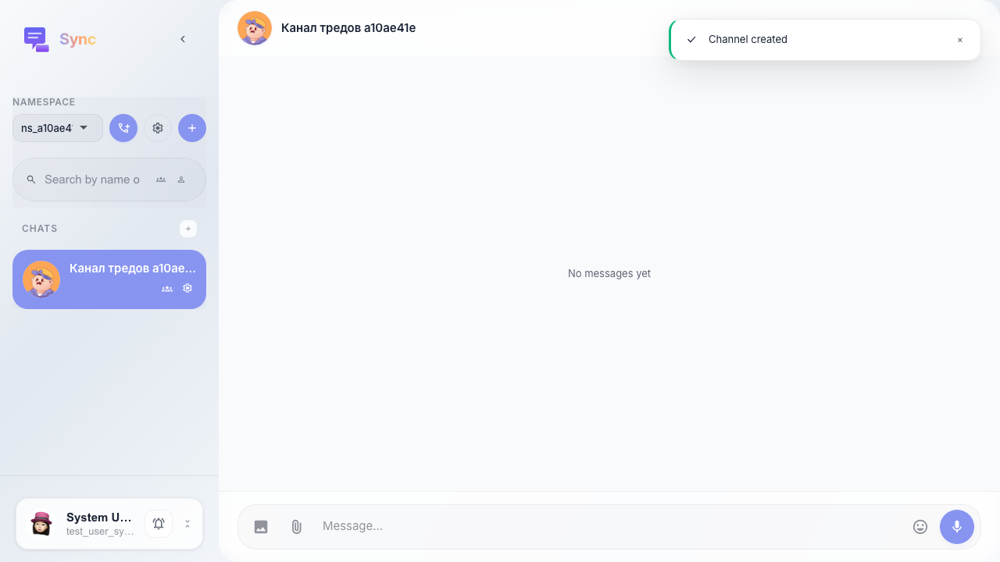
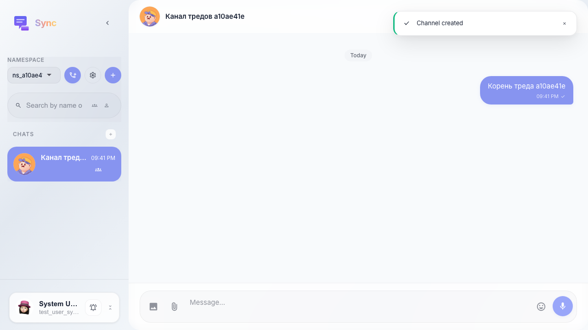
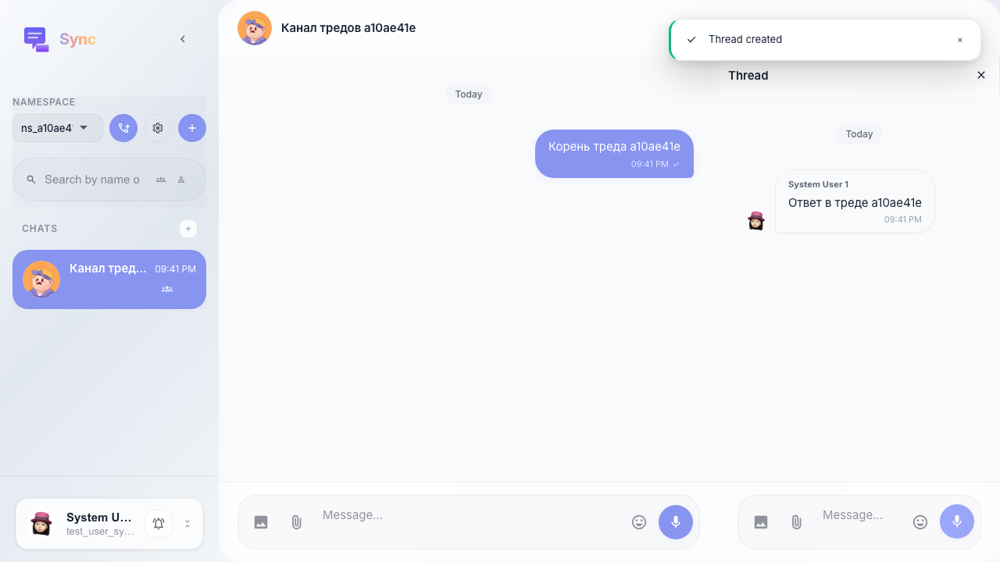
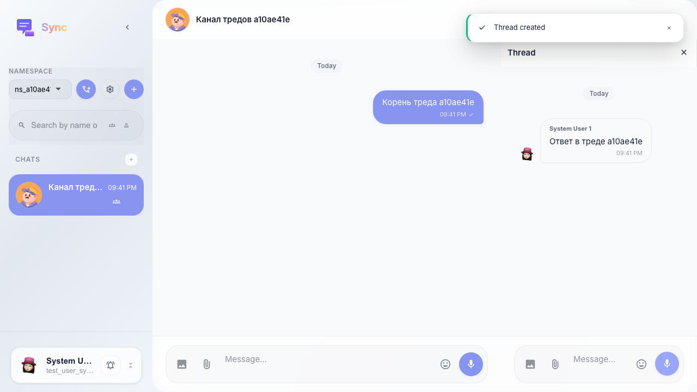

# Sync: панель тредов после ответа на сообщение

Пользователь отвечает на сообщение в основной ленте и открывает панель «Треды»: заголовок и область списка отображаются (список может быть пустым, если thread_id ещё не задан у сообщений в ленте).

## Step 1. Созданы пространство и канал

## Step 2. Отправлено корневое сообщение

## Step 3. Открыт тред и отправлен ответ

## Step 4. Открыта панель тредов

