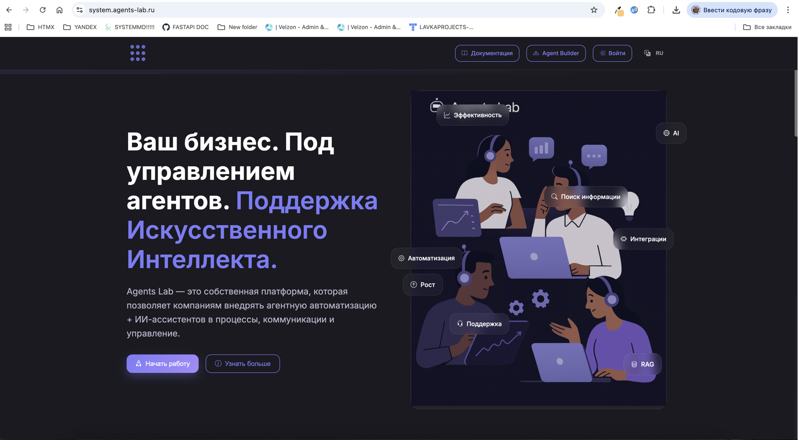

# Добро пожаловать в Agent Lab! :material-robot-happy:

Agent Lab - это современная платформа для создания и управления ИИ-агентами. Создавайте интеллектуальных ботов для автоматизации бизнес-процессов без навыков программирования.

## :material-rocket-launch-outline: Быстрый старт

Новые пользователи начинают отсюда:

1. **[Регистрация и вход](getting_started.md#шаг-1-доступ-к-платформе)** - создайте аккаунт через Yandex или Google
2. **[Создание компании](getting_started.md#создание-компании)** - настройте рабочее пространство
3. **[Магазин ботов](store.md)** - установите готового бота из коллекции
4. **[Подключение платформ](platforms.md)** - настройте Telegram, WhatsApp или API

> 💡 **Совет**: Начните с готовых ботов из магазина - они уже настроены и готовы к работе!

## :material-clipboard-list-outline: Что можно делать в Agent Lab

### :material-robot-outline: Создание ботов
- **Из магазина** - выберите готового бота для типовых задач
- **Через интерфейс** - создайте бота с нуля в визуальном конструкторе
- **Через Builder** - программируйте сложную логику в drag-and-drop редакторе

### :material-connection: Подключение платформ
- **Telegram** - чат-боты и группы
- **WhatsApp** - бизнес-коммуникации
- **Web** - встроенные виджеты на сайт
- **API** - интеграция с существующими системами
- **AmoCRM** - автоматизация продаж

### :material-chart-bar: Управление и аналитика
- **Чаты** - история всех диалогов
- **История** - детальная статистика запросов
- **Биллинг** - отслеживание расходов и пополнение баланса

## :material-account-group-outline: Для кого платформа

### :material-briefcase-variant-outline: Бизнес-пользователи
- Руководители компаний
- Менеджеры по продажам
- Специалисты поддержки
- Маркетологи

### :material-tools: Технические специалисты
- Разработчики
- Системные администраторы
- Аналитики данных
- DevOps инженеры

### :material-lightbulb-on-outline: Предприниматели
- Стартапы
- Фрилансеры
- Консультанты
- Агентства

## :material-currency-usd: Тарифы и оплата

Agent Lab работает по модели pay-as-you-go:
- **Бесплатный тариф** - до 1000 запросов в месяц
- **Базовый** - от 990₽/месяц
- **Премиум** - от 2990₽/месяц
- **Enterprise** - индивидуальные условия

Оплата только за фактическое использование ИИ-моделей (OpenAI, YandexGPT, Gemini).

## :material-book-open-outline: Документация

### :material-play-circle-outline: Быстрый старт
- [Регистрация и настройка](getting_started.md)
- [Магазин ботов](store.md)
- [Создание ботов](bots_creation.md)
- [Подключение платформ](platforms.md)

### :material-star-outline: Продвинутые возможности
- [Визуальный конструктор](builder.md)
- [Переменные и настройки](variables.md)
- [Биллинг и оплата](billing.md)

### :material-bookmark-multiple-outline: Примеры и кейсы
- [Готовые сценарии](scenarios.md)
- [Интеграции](../integrations/amocrm/README.md)
- [Лучшие практики](best_practices.md)

## :material-help-circle-outline: Нужна помощь?

- **💬 Чат поддержки** - в правом нижнем углу интерфейса
- **📧 Email** - support@agent-lab.ru
- **📚 База знаний** - подробные гайды и FAQ
- **👥 Сообщество** - форум пользователей

## :material-update: Что нового

### :material-check-circle-outline: Версия 2.0 (текущая)
- Полностью переработанный интерфейс
- Магазин готовых ботов
- Улучшенная система биллинга
- Поддержка WhatsApp Business API
- Визуальный конструктор агентов

### :material-lightbulb-on-outline: Скоро появится
- Интеграция с AmoCRM
- Расширенная аналитика
- Командная работа
- Кастомные модели ИИ

---

**Готовы начать?** [Зарегистрируйтесь прямо сейчас!](getting_started.md)

*Agent Lab - ИИ для вашего бизнеса*

