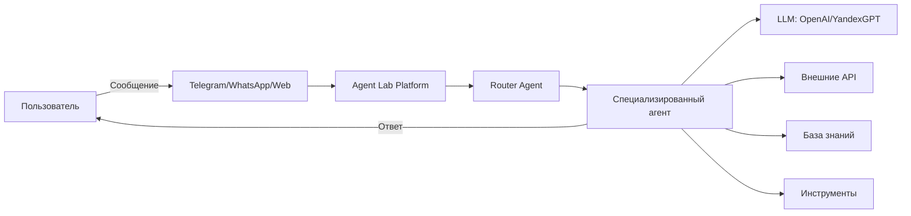

# Обзор Agent Lab

## Что такое Agent Lab?

**Agent Lab** - это платформа для создания и управления умными ИИ-ассистентами (агентами), которые могут:

- Общаться с клиентами в мессенджерах (Telegram, WhatsApp)
- Автоматизировать бизнес-процессы
- Работать с вашими данными и системами
- Принимать решения на основе контекста
- Выполнять сложные многошаговые сценарии

## Для кого это?

### Для бизнеса
- **Автоматизация поддержки** - ИИ-агенты отвечают на типовые вопросы 24/7
- **Увеличение конверсии** - персонализированное общение с клиентами
- **Снижение нагрузки** - рутинные задачи выполняют агенты, люди решают сложные кейсы

### Для разработчиков
- **Быстрое создание** - агенты через веб-интерфейс или код
- **Гибкость** - интеграция с любыми API и сервисами
- **Масштабируемость** - от одного бота до сотен агентов

### Для команд
- **Мультитенантность** - изолированные рабочие пространства для разных компаний
- **Ролевая модель** - разграничение доступа
- **Прозрачность** - полная история взаимодействий

## Основные возможности

### Мультиагентные системы
Создавайте сложные сценарии, где агенты взаимодействуют друг с другом:
- **Router Agent** - направляет запросы к специализированным агентам
- **Specialized Agents** - эксперты в своих областях (поддержка, продажи, аналитика)
- **Coordinator** - управляет выполнением многошаговых процессов

### Мультиканальность
Один агент работает на всех платформах:
- **Telegram** - мессенджер с широкой аудиторией
- **WhatsApp** - для бизнес-коммуникаций
- **Web** - виджет на вашем сайте
- **API** - интеграция в любые системы

### База знаний (RAG)
Агенты используют ваши документы:
- Загрузите инструкции, FAQ, базы знаний
- Агент найдет нужную информацию и ответит
- Векторный поиск для точных ответов

### Встроенный биллинг
Прозрачный учет расходов:
- Токены LLM (OpenAI, YandexGPT, Gemini)
- Вызовы внешних API
- Гибкая система лимитов

### Мультиязычность
Поддержка русского и английского языка:
- Интерфейс автоматически переключается
- Агенты могут общаться на разных языках
- Легко добавить новые языки

## Как это работает?

1. **Пользователь отправляет сообщение** через любой канал
2. **Router Agent определяет** какой специализированный агент нужен
3. **Агент обрабатывает запрос** используя:
   - LLM для понимания и генерации ответов
   - Базу знаний для поиска информации
   - Внешние API для действий (AmoCRM, платежи и т.д.)
   - Инструменты для специфических задач
4. **Пользователь получает ответ** и агент продолжает диалог

## Технологии

Платформа построена на современном стеке:

- **Backend**: Python 3.12, FastAPI
- **LLM Framework**: LangGraph (от LangChain)
- **Database**: PostgreSQL
- **LLM Providers**: OpenAI, YandexGPT, Gemini
- **Frontend**: HTMX, Bootstrap, Vanilla JS
- **Deployment**: Docker, Docker Compose

## Готовы начать?

Переходите к разделу [Начало работы](getting_started.md) для создания вашего первого агента!

