# Настройка бота

## 1. Открытие раздела Боты

Откройте раздел **Боты** в боковом меню. Здесь отображается список всех ваших ботов.

## 2. Выбор бота

Нажмите на карточку бота, чтобы открыть его настройки.

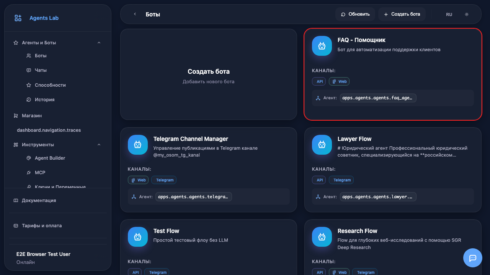

## 3. Панель настроек

Откроется панель настроек бота с несколькими вкладками: Основные, Способности, MCP, База знаний, Каналы, Дополнительно.

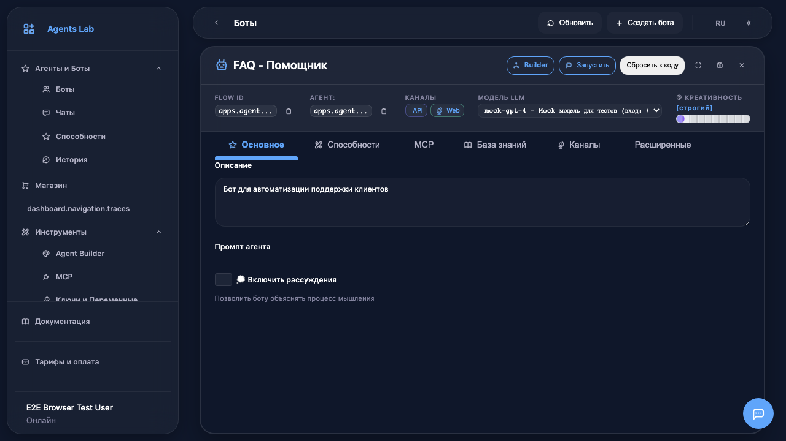

## 4. Вкладка Основные

Перейдите на вкладку **Основные** для редактирования базовых настроек.

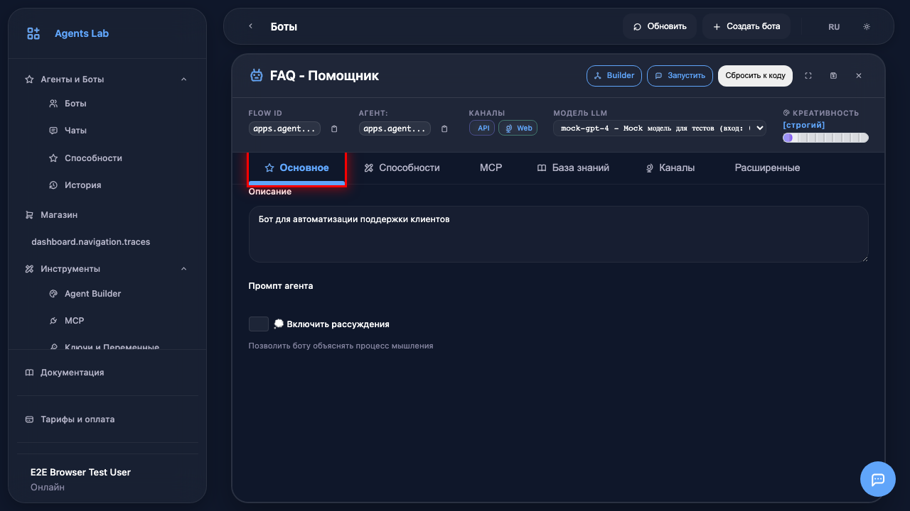

## 5. Основные настройки

На вкладке **Основные** можно изменить описание бота и его промпт (инструкции для ИИ).

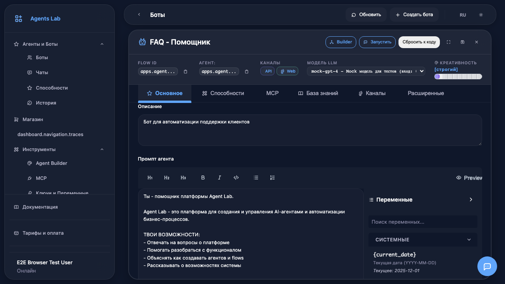

## 6. Редактирование описания

Введите **описание бота** - это поможет понять его назначение.

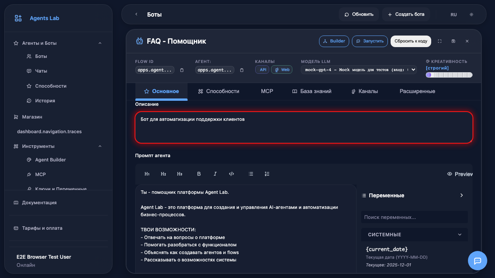

## 7. Вкладка Способности

Перейдите на вкладку **Способности** для управления инструментами бота.

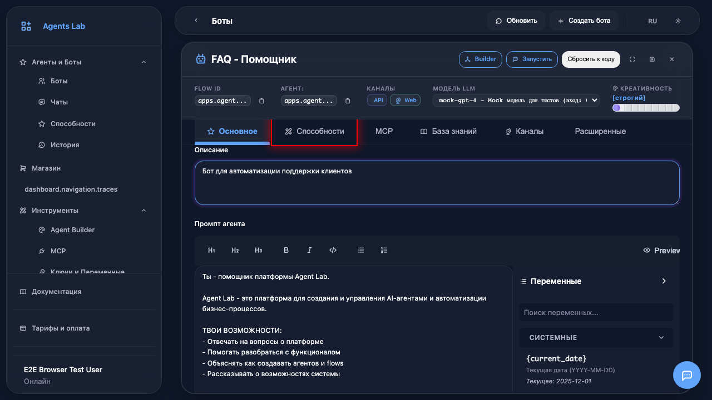

## 8. Настройка инструментов

На вкладке **Способности** отображаются доступные инструменты. Выбранные инструменты бот сможет использовать при общении с пользователями.

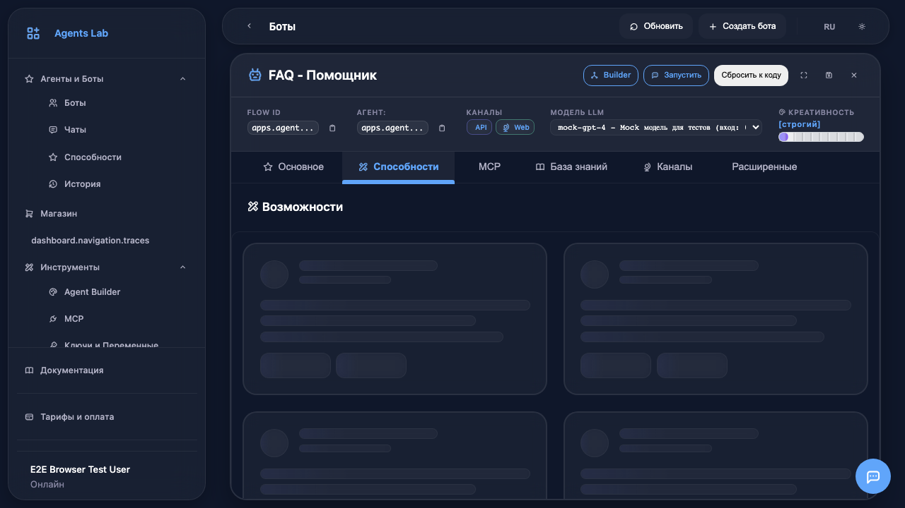

## 9. Вкладка Каналы

Перейдите на вкладку **Каналы** для настройки платформ общения.

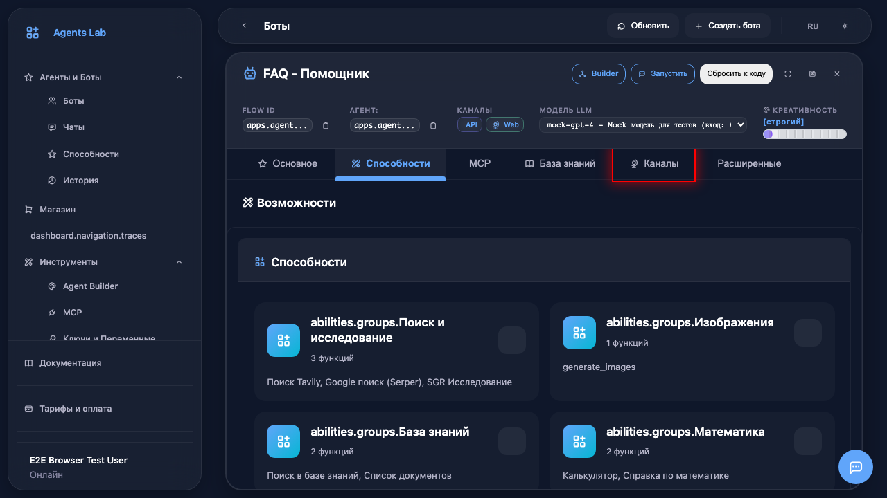

## 10. Настройка каналов

На вкладке **Каналы** можно подключить бота к Telegram, WhatsApp, Web или API. Каждый канал настраивается отдельно.

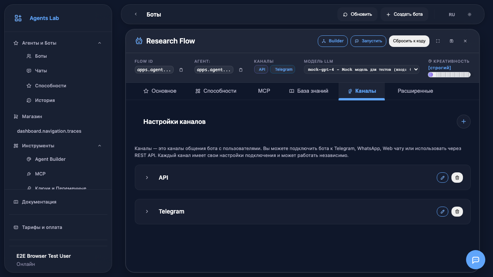

## 11. Возврат к основным

Вернитесь на вкладку **Основные** для настройки модели ИИ.

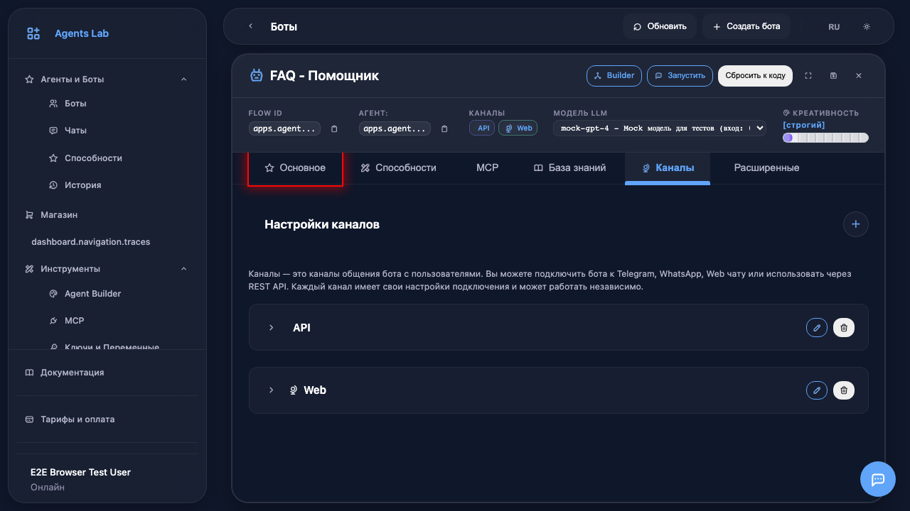

## 12. Выбор модели ИИ

В поле **LLM модель** можно выбрать модель искусственного интеллекта: Claude, GPT-4, Gemini и другие.

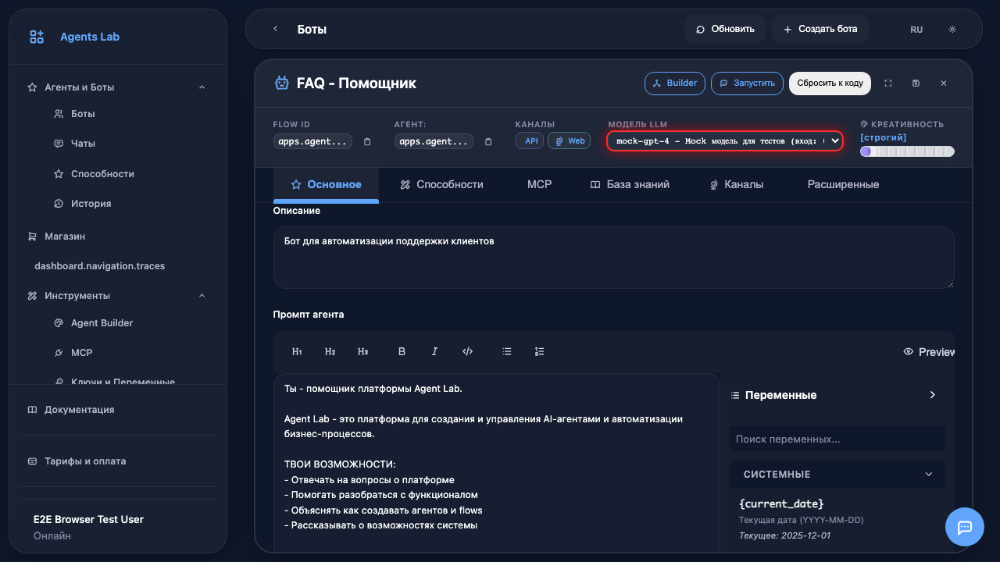

## 13. Сохранение настроек

Нажмите кнопку **сохранения** (иконка дискеты) для применения изменений.

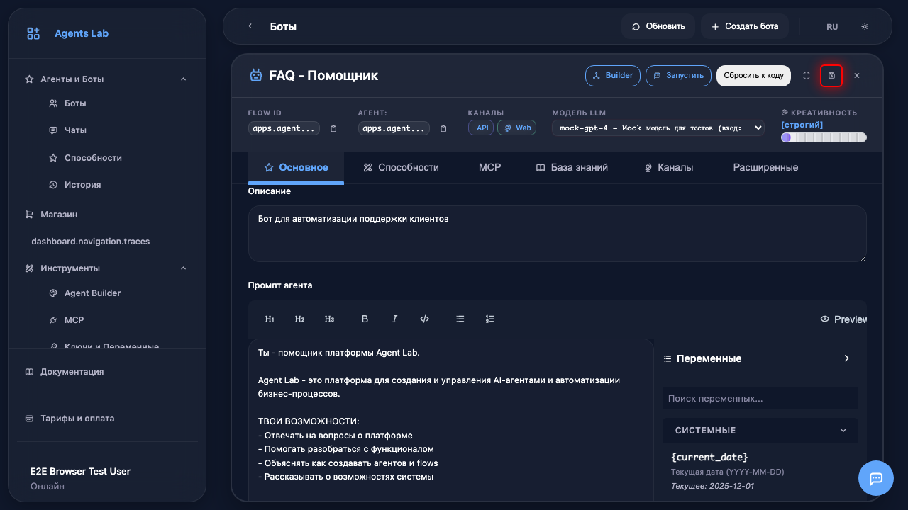

## 14. Настройки сохранены

Настройки сохранены! Бот готов к работе с новыми параметрами.

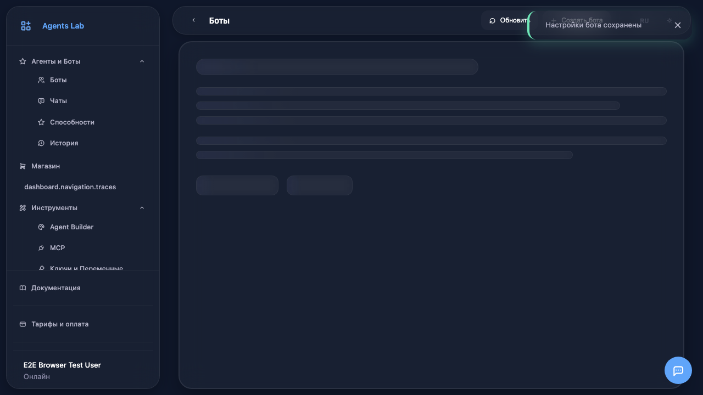
