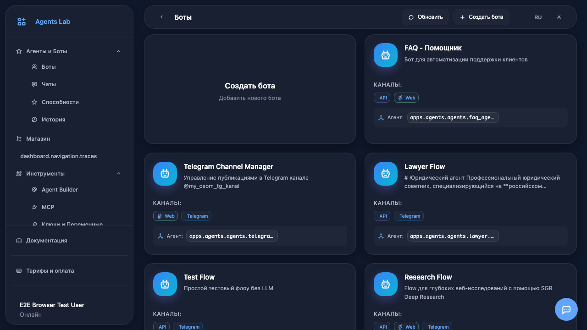
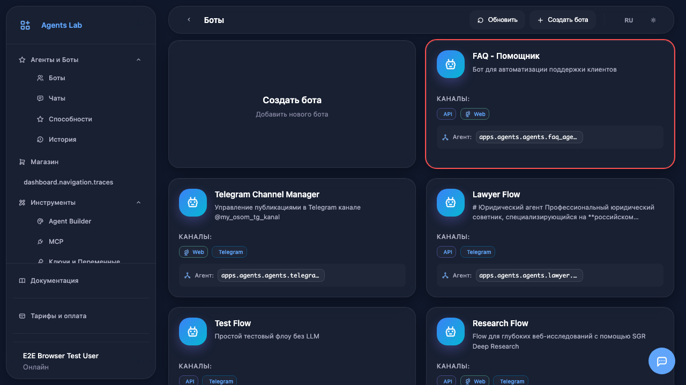
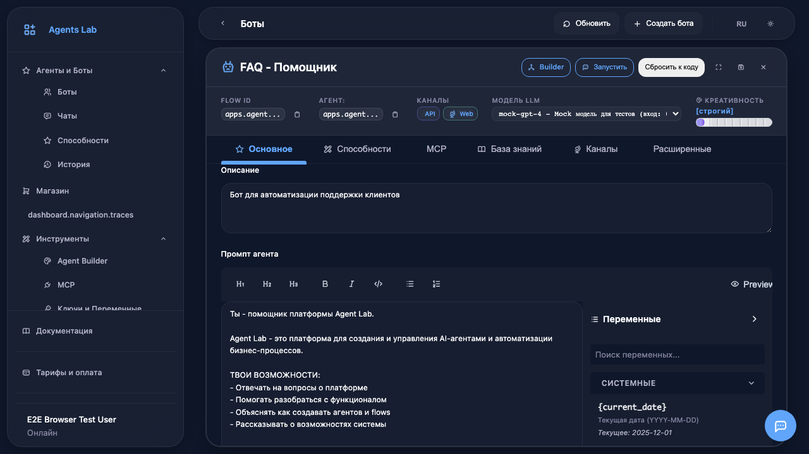
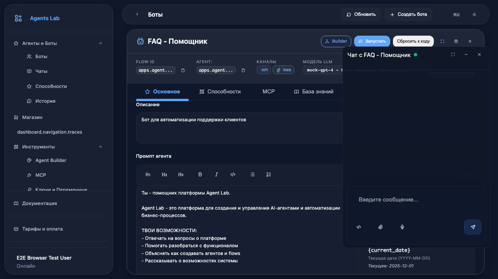
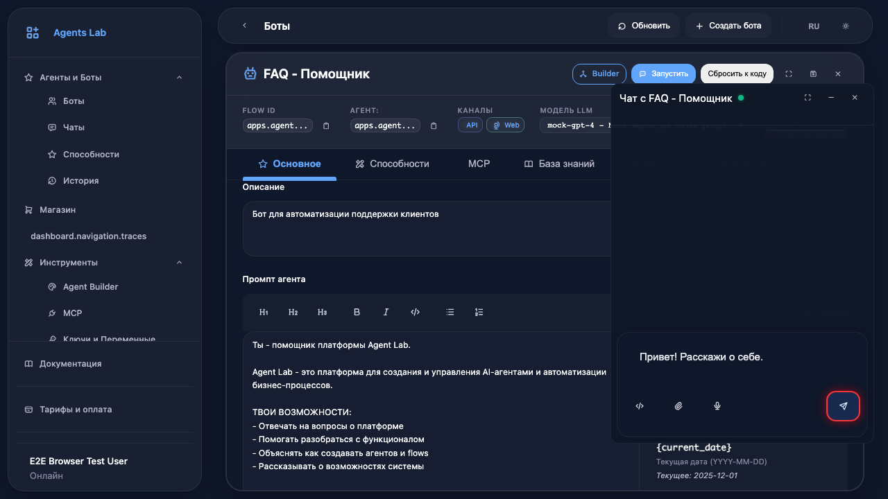
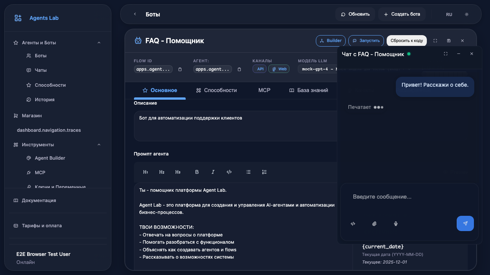

# Общение с ботом

## Шаг 1

Откройте раздел **Боты** в боковом меню. Здесь отображаются все установленные боты.

## Шаг 2

Нажмите на карточку бота для открытия его настроек.

## Шаг 3

Откроется панель управления ботом с настройками и кнопкой запуска.

## Шаг 4

Нажмите кнопку **Запустить** для открытия чата с ботом.

## Шаг 5

Откроется окно чата. Дождитесь подключения (индикатор станет зелёным).

## Шаг 6

Введите сообщение в поле ввода внизу чата.

## Шаг 7

Нажмите кнопку отправки или клавишу Enter.

## Шаг 8

Бот обработает ваше сообщение и отправит ответ. Вы можете продолжить диалог, задавая вопросы.

