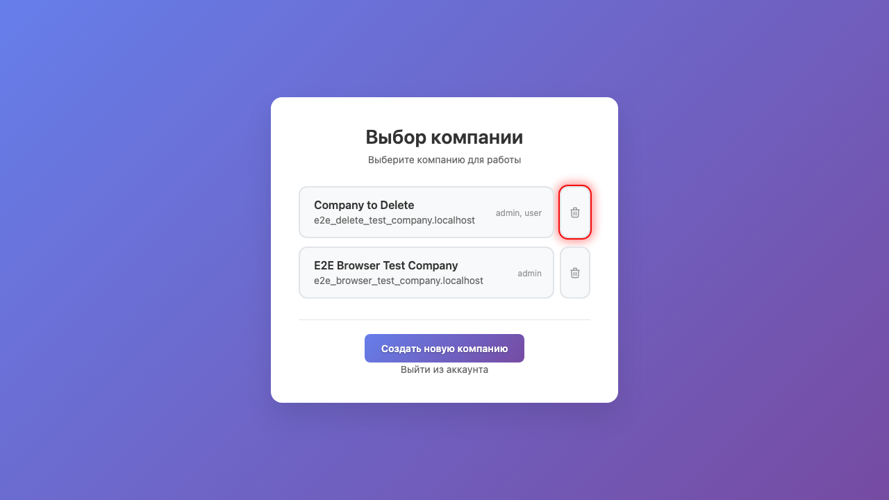
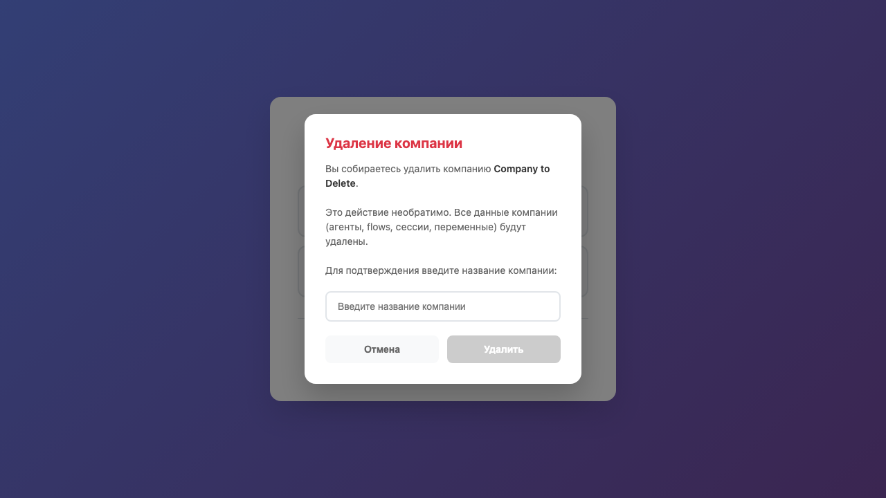
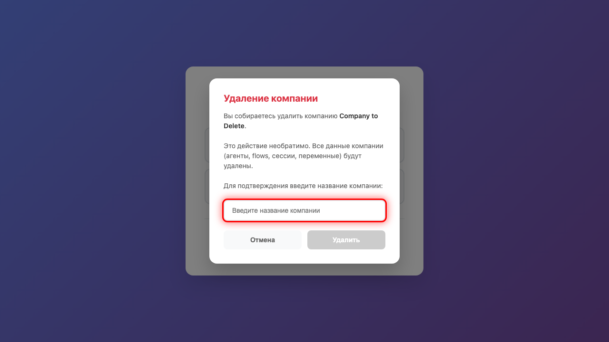
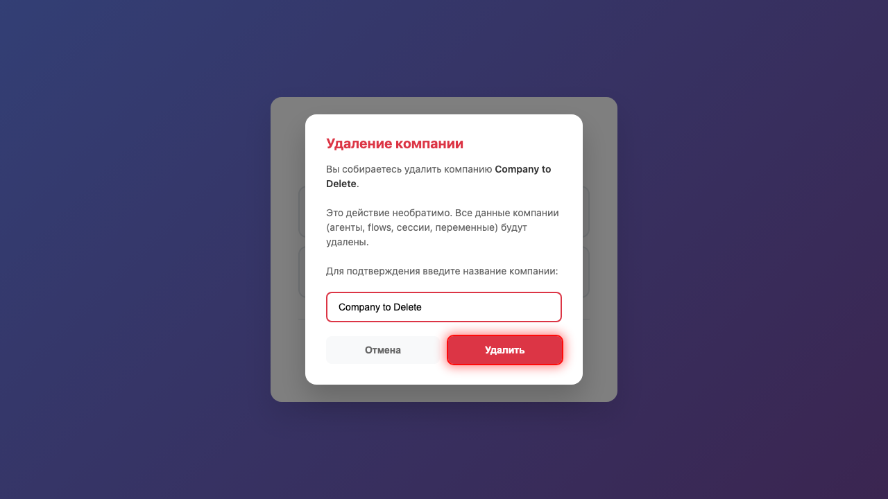
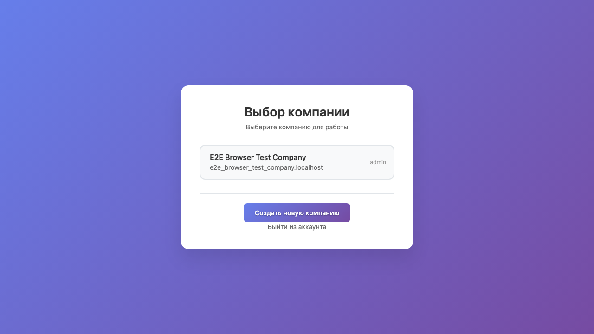

# Удаление компании

## 1. Страница выбора компании

Откройте страницу **Выбор компании**. Здесь отображаются все компании, в которых вы являетесь участником. Для удаления компании нужна роль **admin**.

## 2. Кнопка удаления

Нажмите кнопку **удаления** (иконка корзины) напротив компании **Company to Delete**. Кнопка доступна только для администраторов компании.

## 3. Окно подтверждения

Откроется окно подтверждения удаления. Это действие необратимо - все данные компании (боты, flows, переменные, сессии) будут удалены.

## 4. Ввод названия

Введите название компании **Company to Delete** для подтверждения удаления. Это защита от случайного удаления.

## 5. Подтверждение удаления

Нажмите кнопку **Удалить** для запуска процесса удаления. Удаление выполняется асинхронно и может занять несколько секунд.

## 6. Компания удалена

Компания **Company to Delete** успешно удалена. Она больше не отображается в списке ваших компаний. Все данные компании были удалены из системы.

