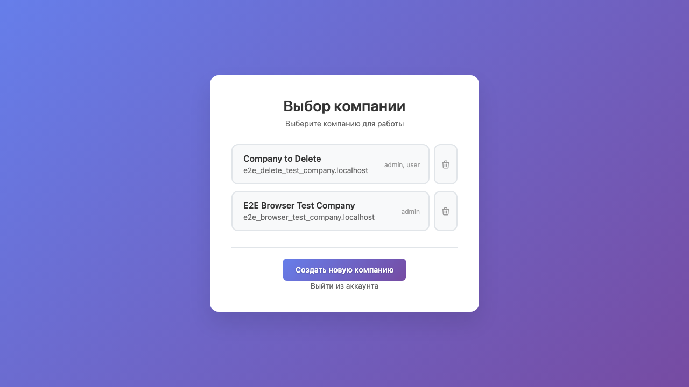
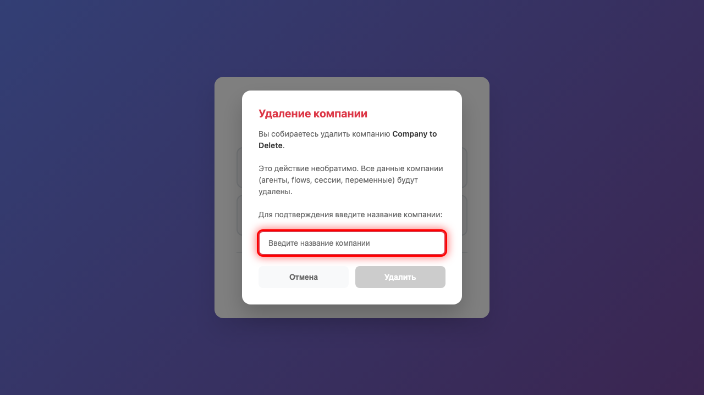

# Валидация при удалении компании

## 1. Страница выбора

Откройте страницу выбора компании.

## 2. Кнопка неактивна

Кнопка **Удалить** изначально неактивна. Это защита от случайного удаления компании.

## 3. Неправильное название

Если ввести **неправильное** название компании, кнопка удаления останется неактивной.

## 4. Правильное название

Введите **точное** название компании: **Company to Delete**. Кнопка станет активной.

