# Создание и настройка MCP сервера

## 1. Открытие раздела MCP

Откройте раздел **MCP** в боковом меню. MCP (Model Context Protocol) позволяет подключать внешние инструменты к вашим ботам.

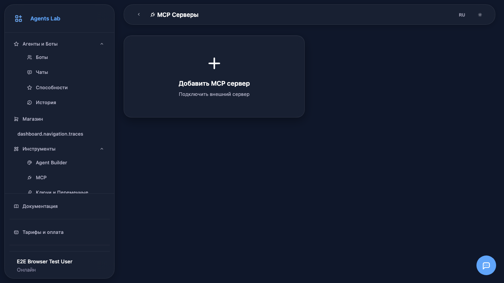

## 2. Добавление сервера

Нажмите на карточку **Добавить MCP сервер** для создания нового подключения.

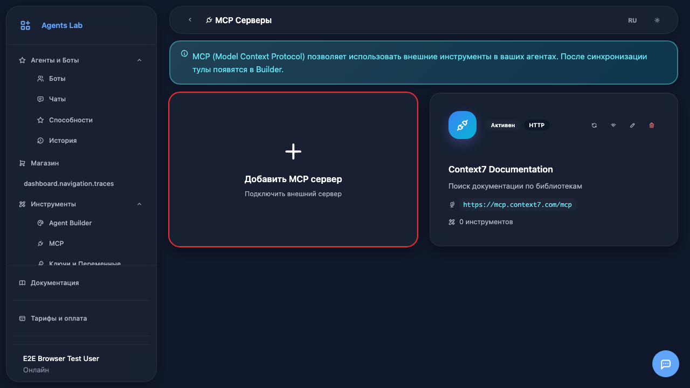

## 3. Форма настройки

Откроется форма для настройки MCP сервера. Заполните все необходимые поля.

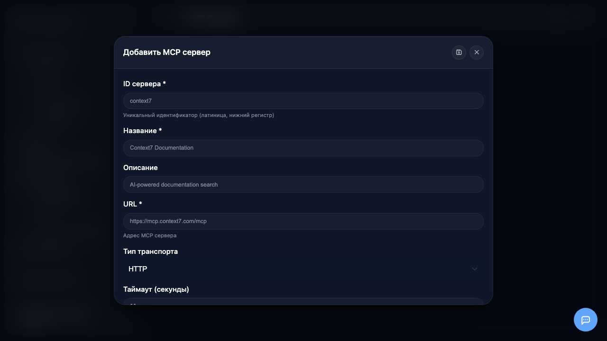

## 4. Ввод ID сервера

Введите **ID сервера** - уникальный идентификатор (латиница, без пробелов). Например: `context7`, `weather_api`, `my_tools`.

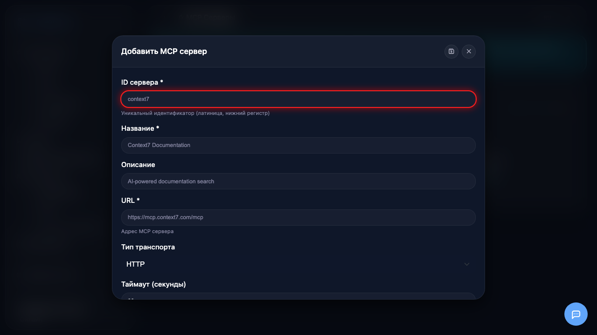

## 5. Ввод названия

Введите **название** сервера - понятное описание для отображения в интерфейсе.

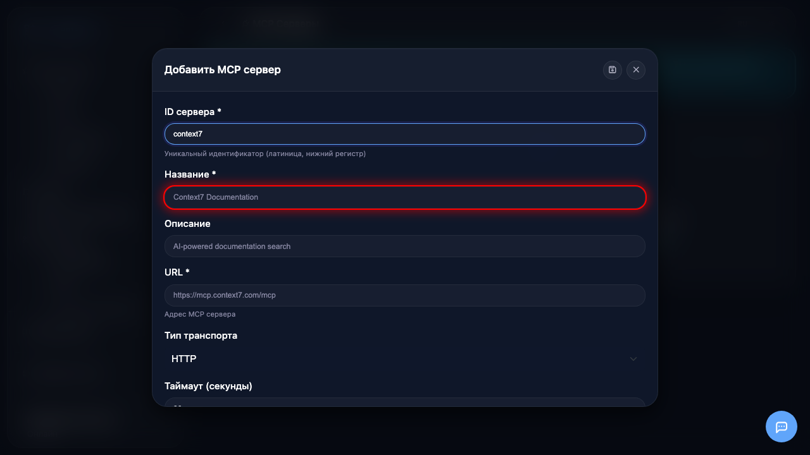

## 6. Ввод описания

Добавьте **описание** - для чего используется этот MCP сервер.

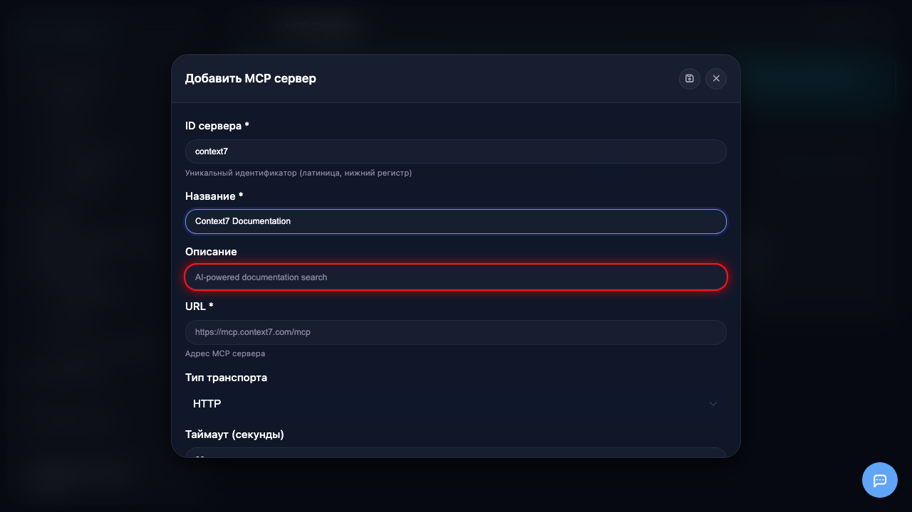

## 7. Ввод URL

Введите **URL** MCP сервера - адрес для подключения. Уточните URL в документации сервера.

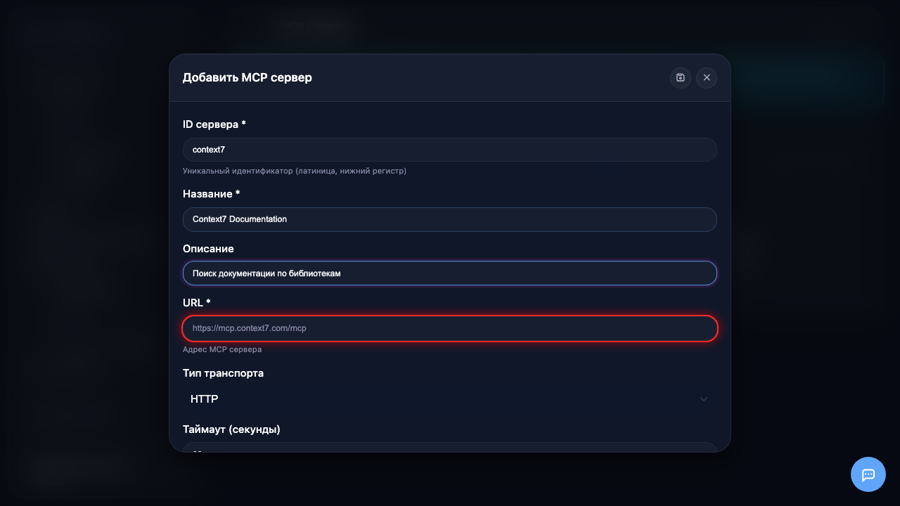

## 8. Выбор типа транспорта

Выберите **тип транспорта**: HTTP для стандартных запросов или SSE для серверов с потоковой передачей.

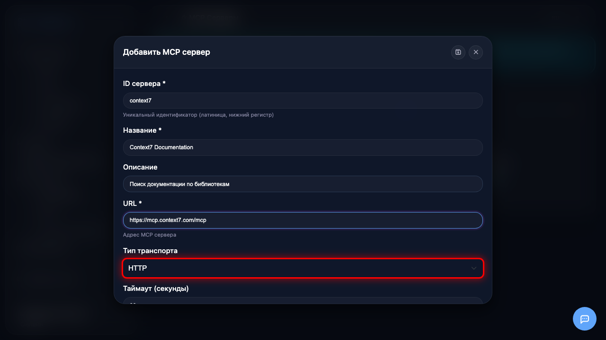

## 9. Настройка заголовков

Настройте **HTTP заголовки** для авторизации. Используйте `@var:key` для ссылок на переменные (рекомендуется для API ключей).

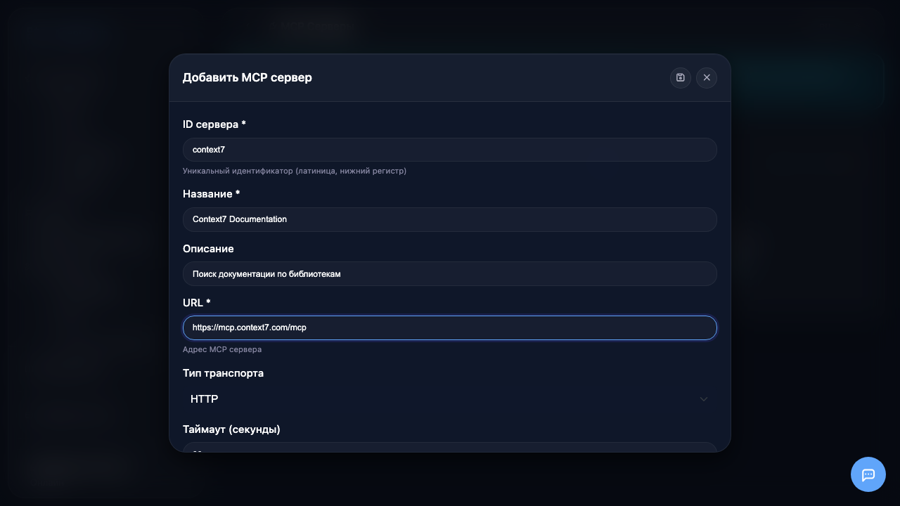

## 10. Дополнительные опции

Настройте дополнительные опции:
- **Использовать прокси** - для работы через корпоративный прокси
- **Активен** - включить/выключить сервер
- **Автосинхронизация** - автоматически обновлять список инструментов

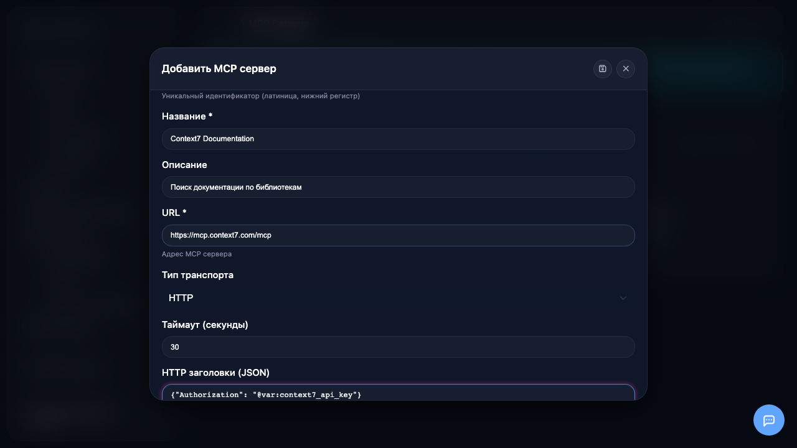

## 11. Сохранение сервера

Нажмите кнопку **сохранения** (иконка дискеты) для создания сервера.

## 12. Синхронизация инструментов

MCP сервер создан! Теперь нажмите кнопку **синхронизации** (иконка обновления) на карточке сервера, чтобы загрузить список доступных инструментов.

## 13. Использование в ботах

После синхронизации инструменты MCP сервера появятся в настройках ботов на вкладке **MCP**. Выберите нужные инструменты для каждого бота.

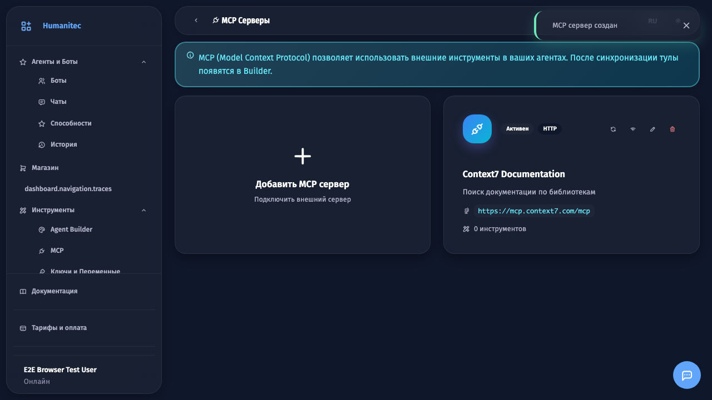
