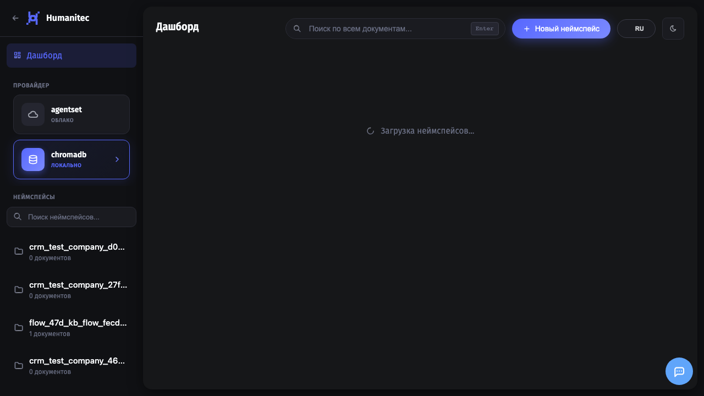
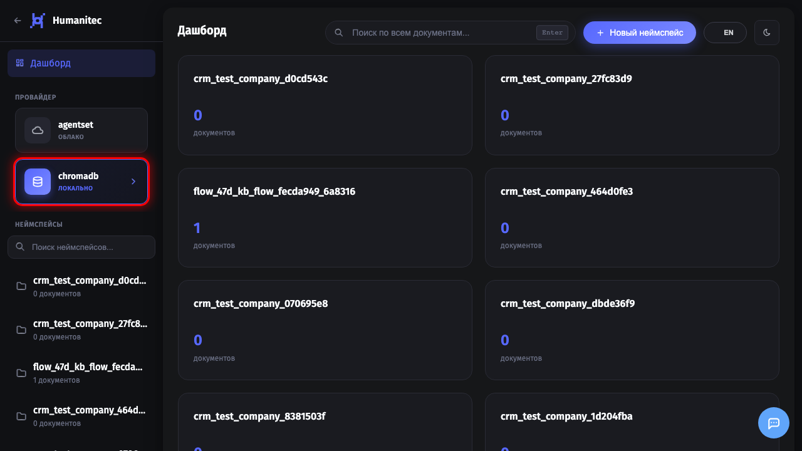
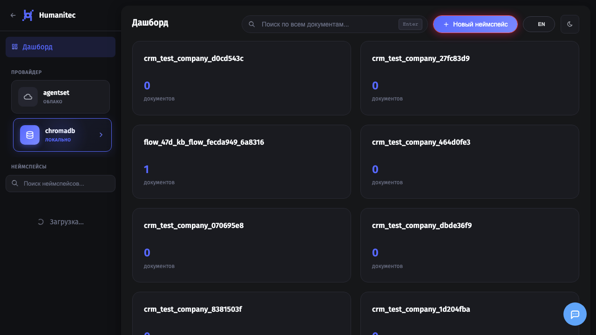
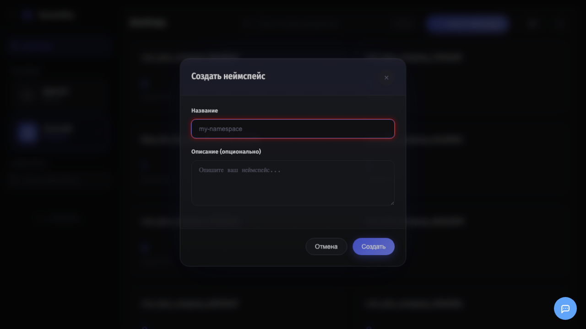
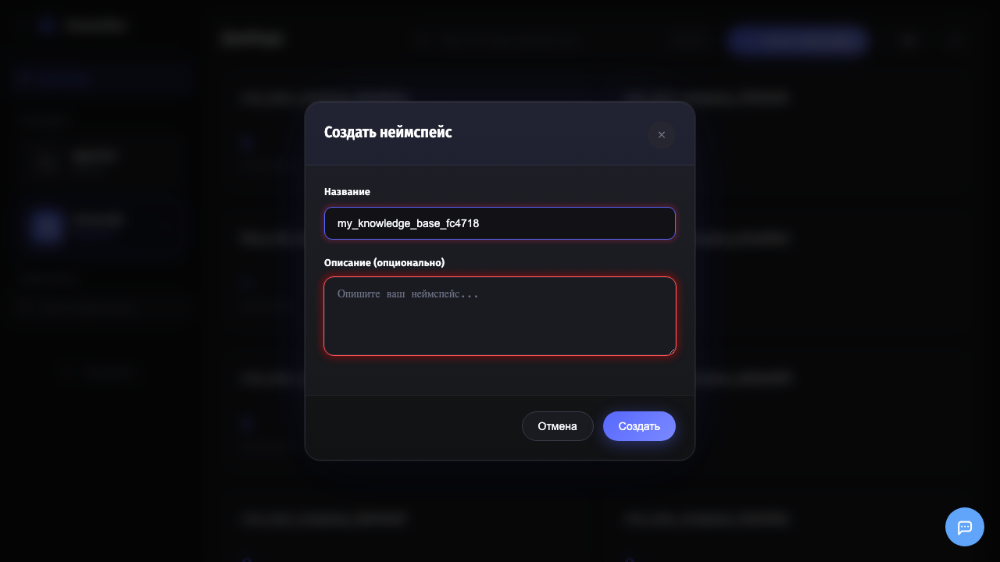
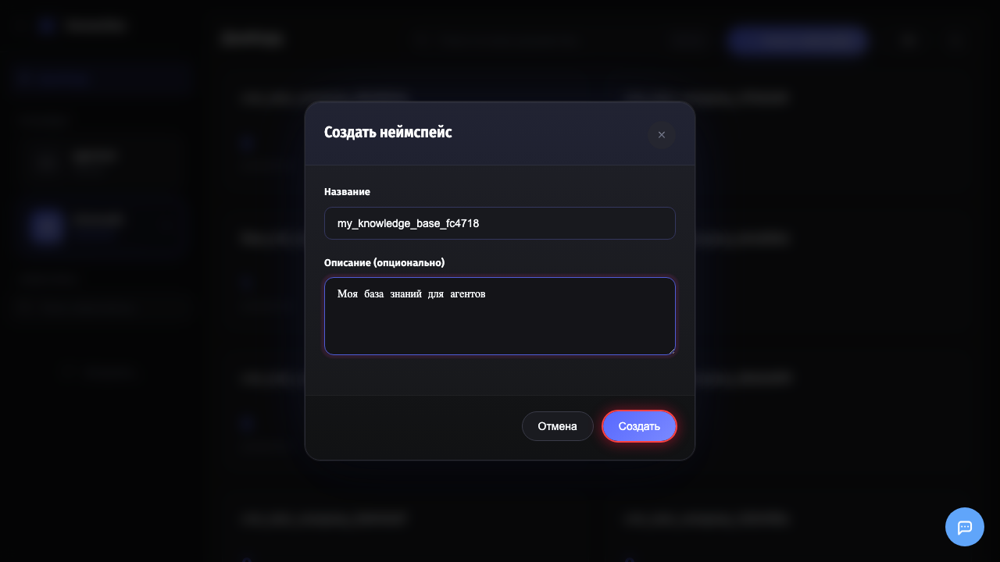

# Создание namespace в RAG

## 1. Открытие RAG Dashboard

Перейдите в раздел **RAG** через боковое меню. Здесь создаются и управляются коллекции документов (namespaces).

## 2. Выбор провайдера

Выберите **ChromaDB** для локального хранения документов. Все данные останутся на вашем сервере.

## 3. Начало создания namespace

Нажмите кнопку **New Namespace** в правом верхнем углу.

## 4. Форма создания

Откроется модальное окно с полями для ввода.

## 5. Ввод имени namespace

Введите понятное **имя** для вашей коллекции документов. Используйте латиницу и подчеркивания, например:
- `product_catalog` - каталог продуктов
- `company_policies` - политики компании
- `faq_knowledge` - база знаний FAQ

## 6. Добавление описания

Добавьте **описание** чтобы другие пользователи понимали назначение коллекции.

## 7. Создание namespace

Нажмите **Create** для создания namespace.

