# Поиск по документам в RAG

## 1. Открытие RAG Dashboard

Откройте раздел **RAG** для управления документами. Здесь отображаются все ваши неймспейсы (коллекции документов).

## 2. Выбор провайдера

Убедитесь что выбран нужный провайдер (ChromaDB для локального хранения). Провайдер определяет где будут храниться ваши документы.

## 3. Создание неймспейса

Нажмите кнопку **New Namespace** для создания новой коллекции документов. Неймспейс - это изолированное хранилище для группы связанных документов.

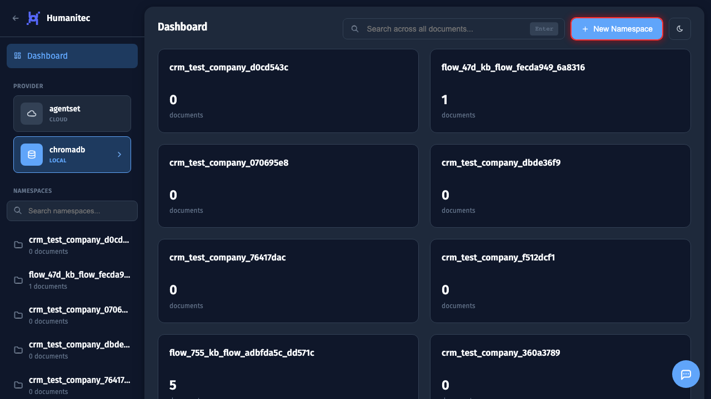

## 4. Форма создания неймспейса

Откроется модальное окно для ввода данных неймспейса.

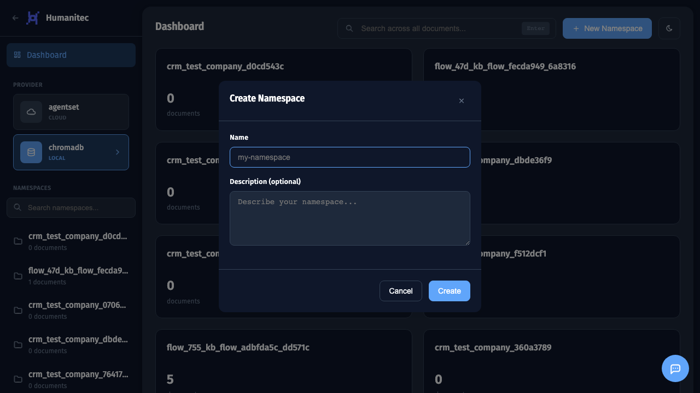

## 5. Ввод имени

Введите **имя неймспейса**. Используйте понятное название, например: `product_docs`, `faq`, `contracts`.

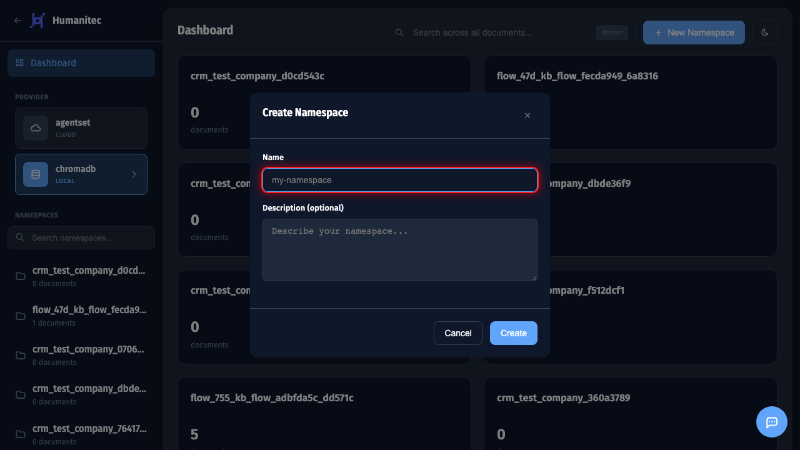

## 6. Добавление описания

Добавьте **описание** чтобы было понятно назначение коллекции.

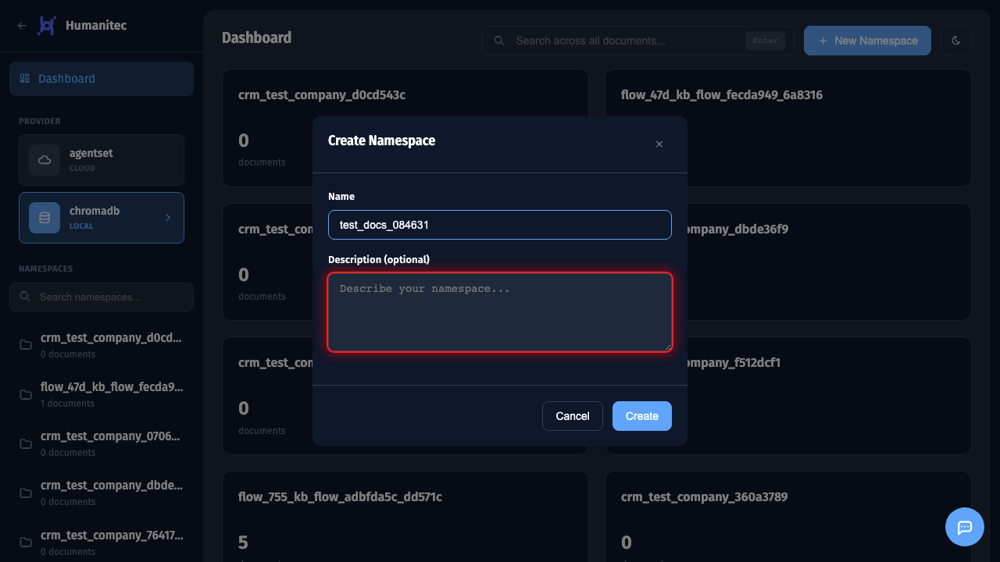

## 7. Сохранение неймспейса

Нажмите **Create** для создания неймспейса.

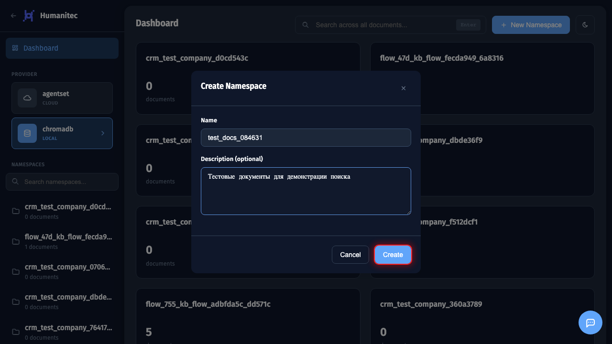

## 8. Неймспейс создан

Неймспейс появится в списке слева и на главной панели. Теперь можно загружать в него документы.

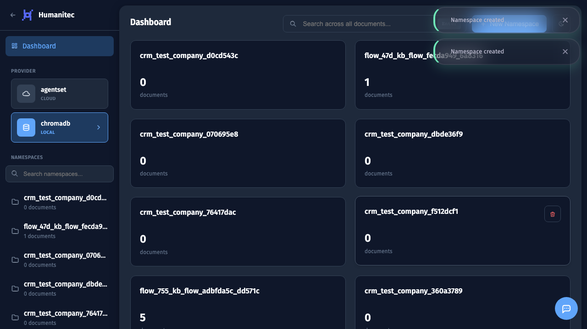

## 9. Открытие неймспейса

Нажмите на неймспейс чтобы открыть его и увидеть список документов.

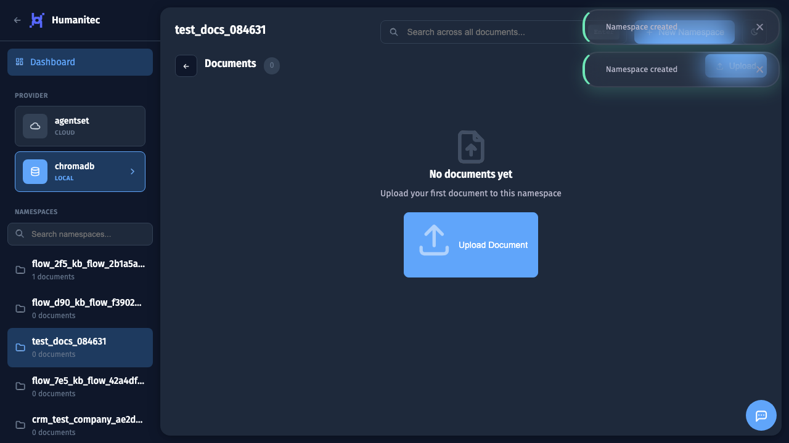

## 10. Открытие загрузки

Нажмите кнопку **Upload** для загрузки документов.

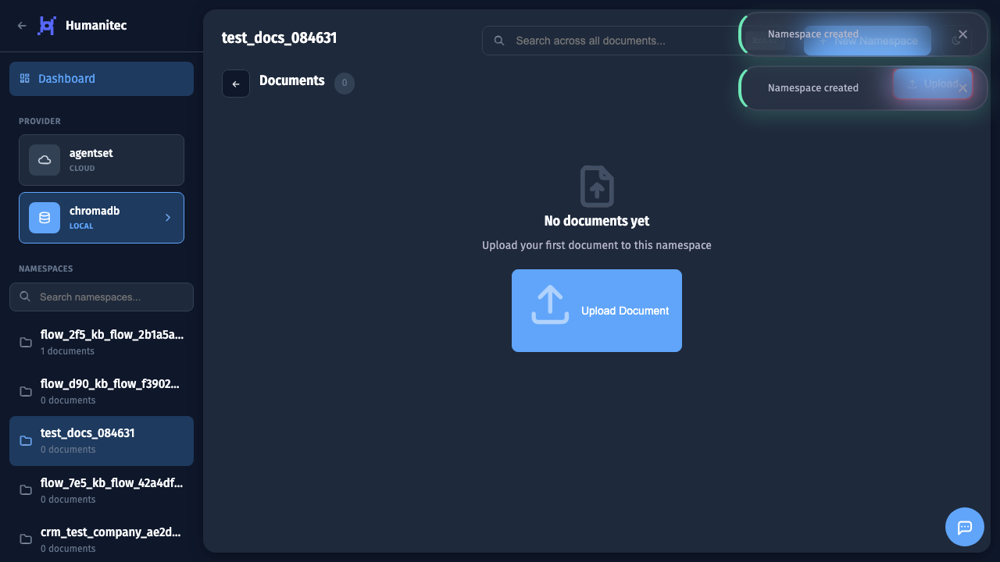

## 11. Форма загрузки файлов

В модальном окне можно перетащить файлы или выбрать через проводник. Поддерживаются форматы: PDF, DOCX, TXT, XLSX, CSV, HTML, MD, JSON.

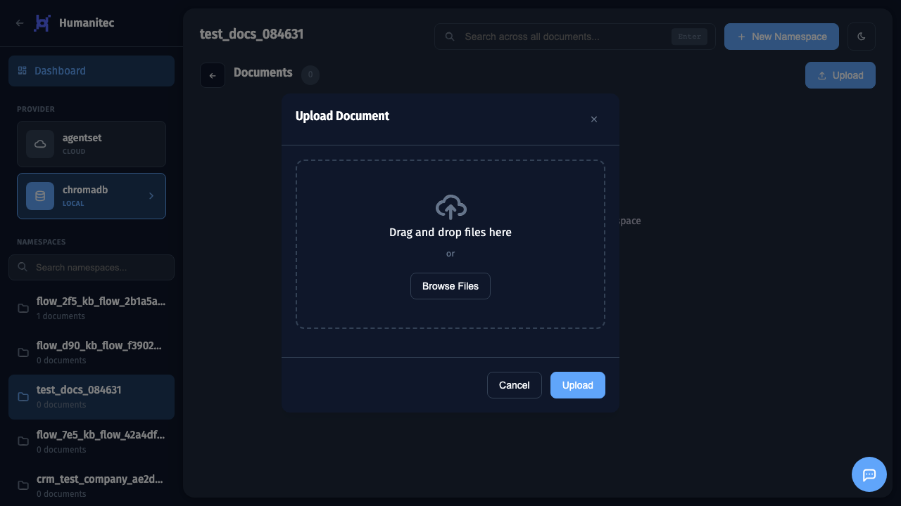

## 12. Выбор файлов

Выбраны файлы для загрузки:
- **Анкета 09.25.docx** - документ Word
- **all_products.xlsx** - таблица Excel

Файлы отображаются в списке перед загрузкой.

## 13. Загрузка файлов

Нажмите **Upload** для начала загрузки. Документы будут проиндексированы и добавлены в векторное хранилище.

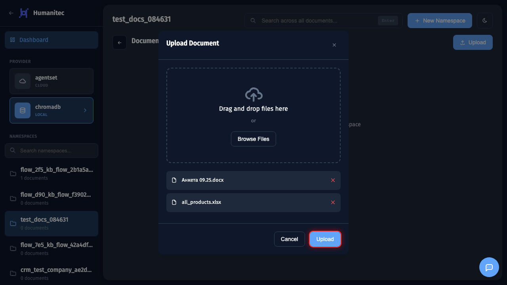

## 14. Документы загружены

Загруженные документы отображаются в виде карточек. Для каждого документа показан тип файла и статус обработки.

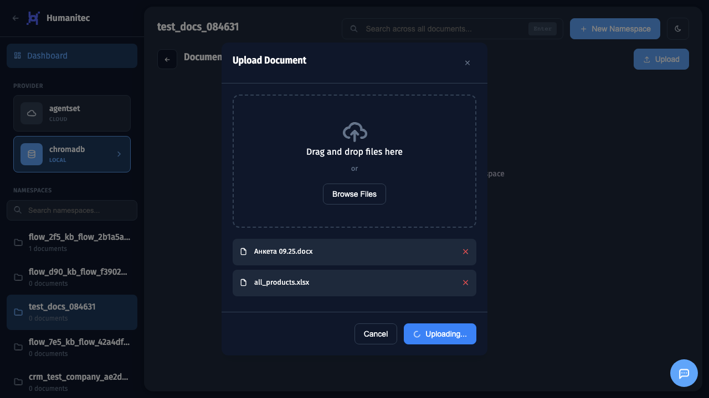

## 15. Ввод поискового запроса

Введите поисковый запрос в поле **Search across all documents**. Например: `Краткое описание` для поиска соответствующих фрагментов.

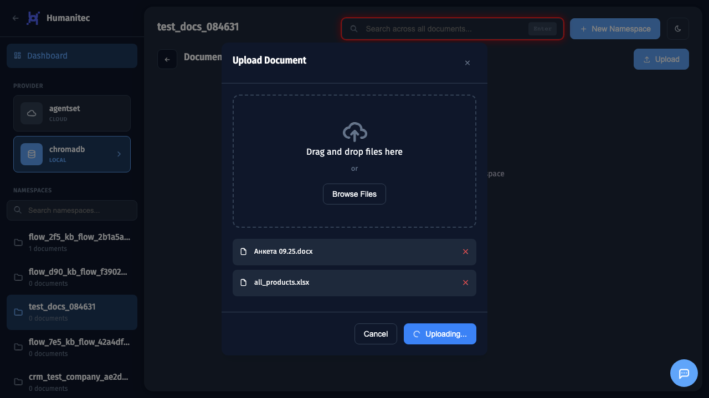

## 16. Выполнение поиска

Нажмите **Enter** для выполнения семантического поиска. RAG найдет наиболее релевантные фрагменты документов.

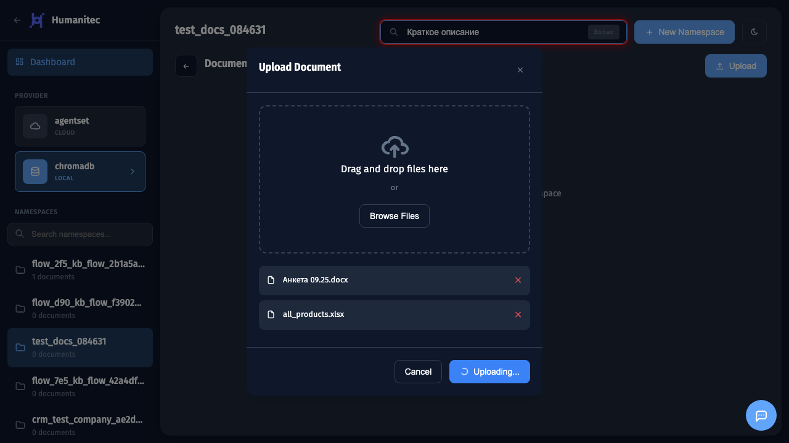

## 17. Результаты поиска

Откроется окно с результатами поиска. Для каждого результата показано:
- Название исходного документа
- Релевантный фрагмент текста с подсветкой
- Процент совпадения (score)
- Кнопка скачивания документа

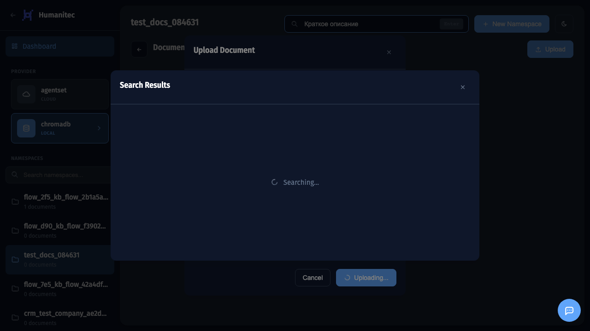
