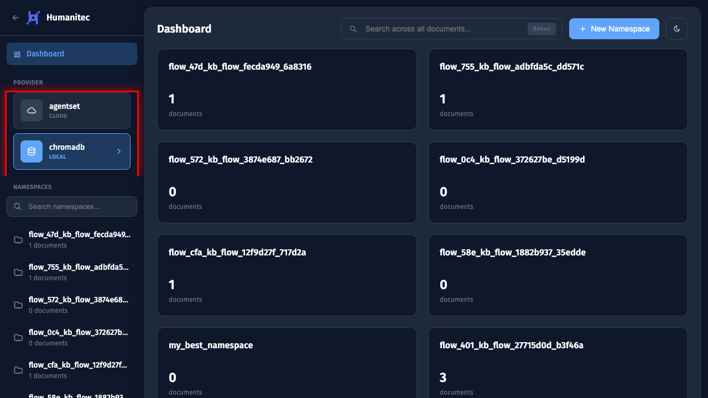

# Поиск по документам в RAG

## 1. Открытие RAG Dashboard

Откройте раздел **RAG** для управления документами. Здесь отображаются все ваши неймспейсы (коллекции документов).

## 2. Выбор провайдера

Убедитесь что выбран нужный провайдер (ChromaDB для локального хранения). Провайдер определяет где будут храниться ваши документы.

