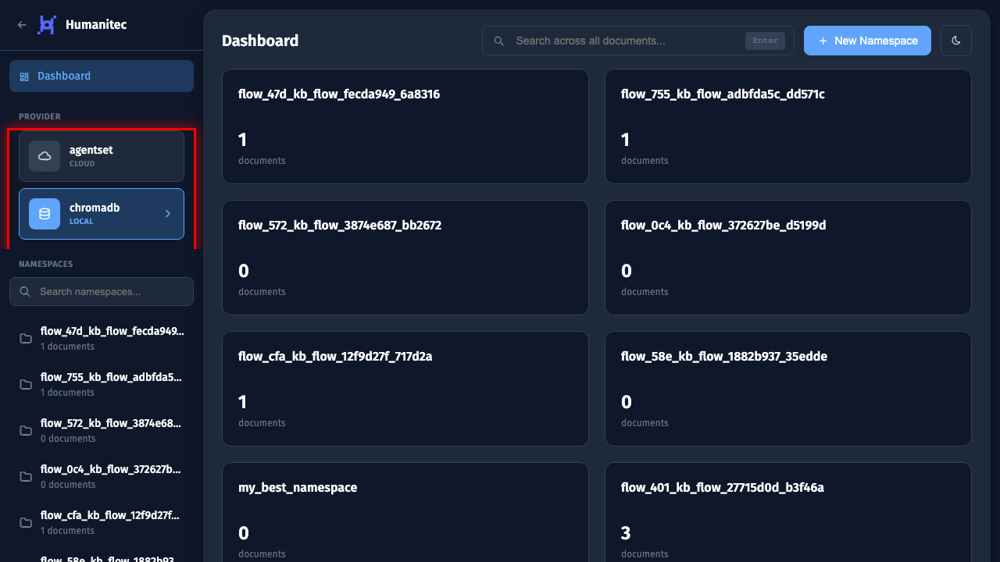
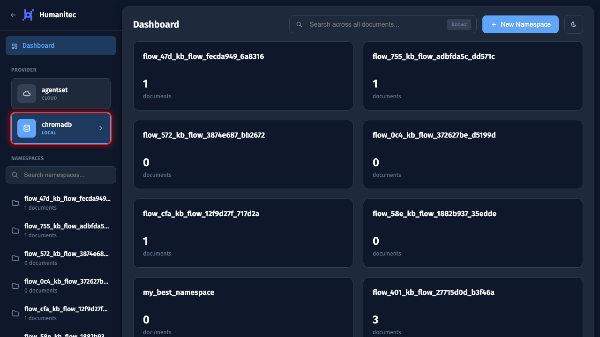
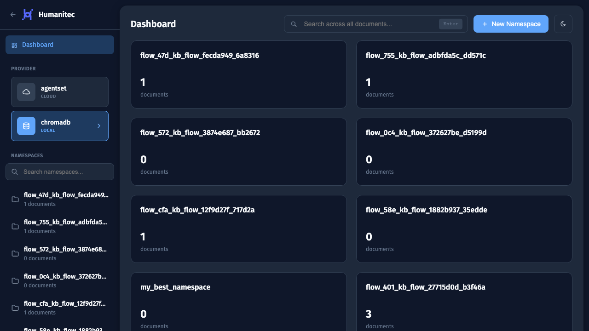
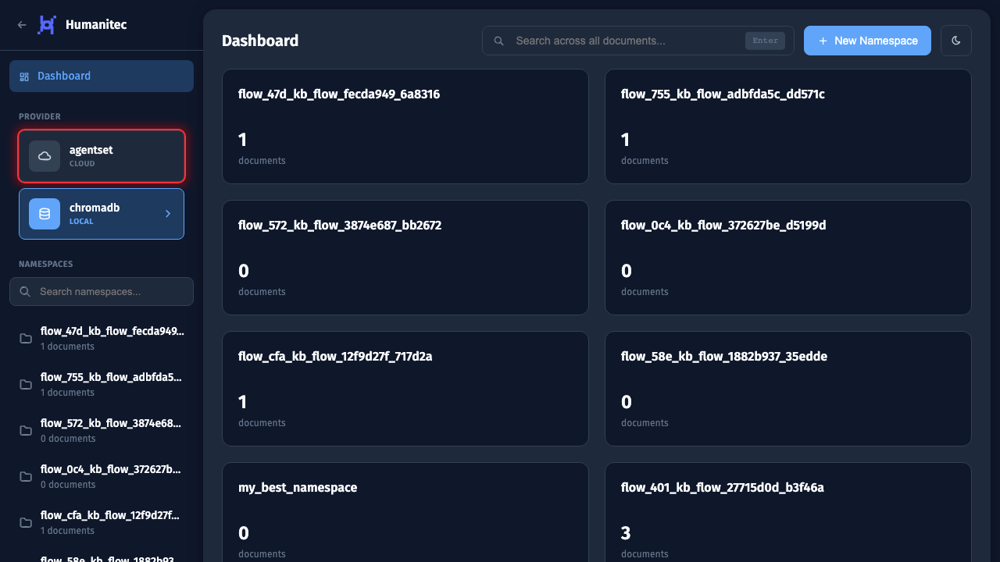

# Выбор провайдера RAG

## 1. Открытие раздела RAG

Откройте раздел **RAG** через боковое меню или перейдите по адресу `/rag/`. Здесь вы управляете векторными хранилищами для поиска по документам.

## 2. Обзор провайдеров

В боковой панели отображаются доступные RAG провайдеры:

**ChromaDB** (LOCAL):
- Локальное векторное хранилище
- Данные хранятся на вашем сервере в РФ
- Экономичное решение - без абонентской платы
- Подходит для чувствительных данных

**Agentset** (CLOUD):
- Облачный SaaS провайдер
- Готовая инфраструктура без настройки
- Автоматическое масштабирование
- Дороже, но удобнее для быстрого старта

## 3. Выбор ChromaDB

Нажмите на карточку **ChromaDB** для выбора локального провайдера. Это оптимальный выбор если:
- Важна безопасность данных (хранение в РФ)
- Нужен контроль над инфраструктурой
- Ограниченный бюджет

## 4. Провайдер выбран

Выбранный провайдер отмечается подсветкой. Теперь все операции (создание неймспейсов, загрузка документов) будут выполняться через этот провайдер.

## 5. Переключение на Agentset

Для переключения на облачный провайдер нажмите **Agentset**. Рекомендуется если:
- Нужен быстрый старт без настройки
- Важна надежность и доступность
- Готовы платить за удобство

