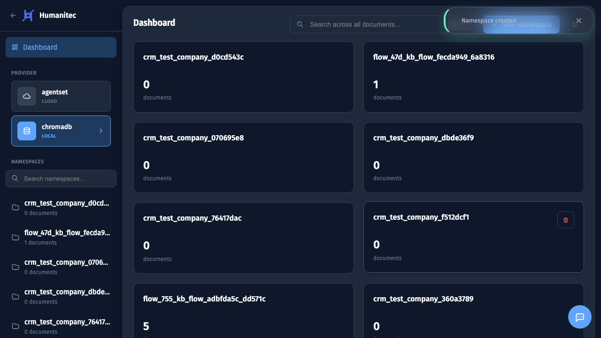
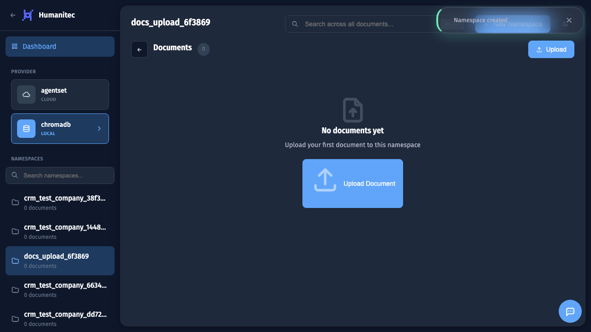
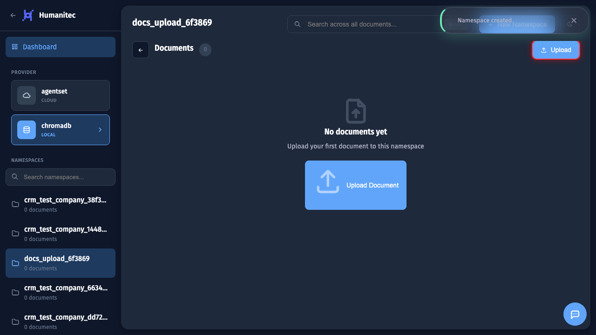
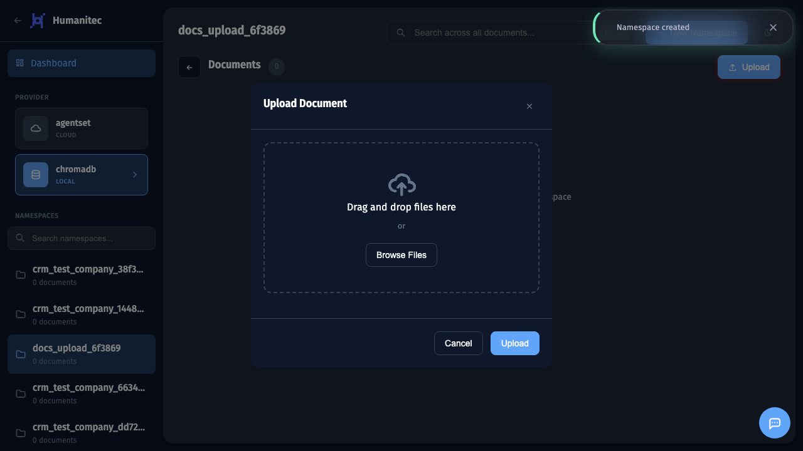
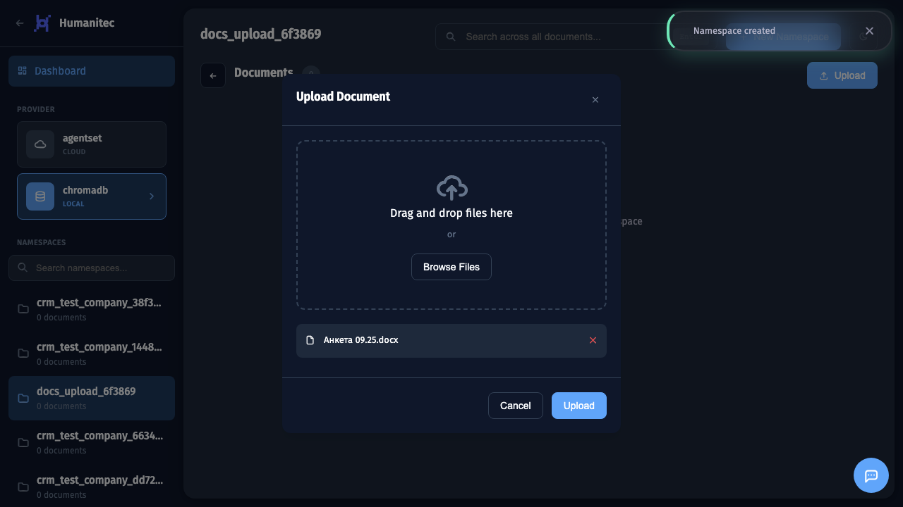
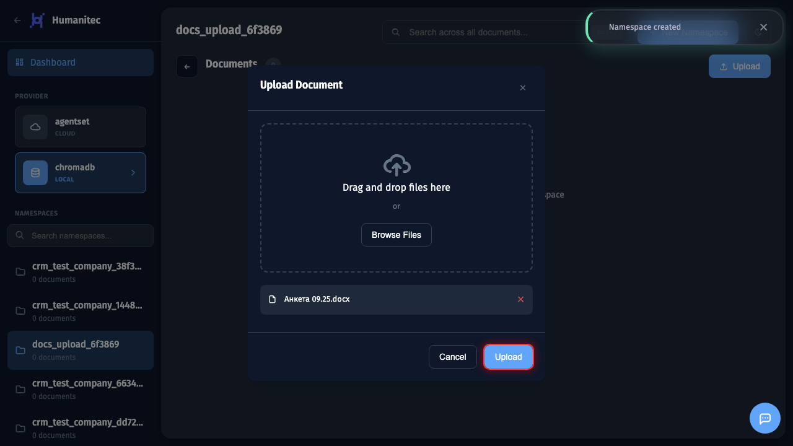
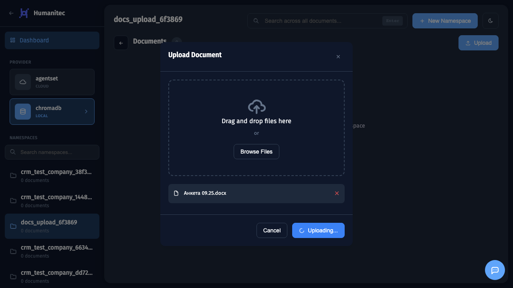
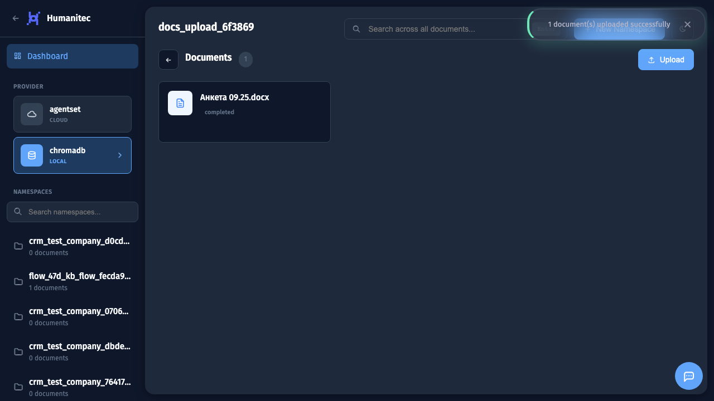

# Загрузка документов в RAG

## 1. Подготовка namespace

Создан namespace для загрузки документов. Нажмите на него чтобы открыть.

## 2. Открытие namespace

Внутри namespace пока пусто. Загрузим документы.

## 3. Открытие формы загрузки

Нажмите кнопку **Upload** для загрузки документов.

## 4. Drag & Drop зона

Откроется окно загрузки. Вы можете:
- **Перетащить файлы** прямо в зону загрузки
- Нажать **Browse Files** для выбора через проводник

**Поддерживаемые форматы:**
- Документы: PDF, DOCX, TXT, MD
- Таблицы: XLSX, CSV
- Веб: HTML, JSON, XML

## 5. Выбор файлов

Выбранные файлы отображаются в списке. Можно добавить несколько файлов перед загрузкой.

## 6. Запуск загрузки

Нажмите **Upload** для начала загрузки.

Асинхронная обработка:
- Файл мгновенно загружается в хранилище
- Обработка (парсинг, индексация) выполняется в фоне
- Вы получите уведомление когда документ будет готов к поиску

## 7. Документ в обработке

Документ поставлен в очередь на обработку. Статус изменится на **ready** когда индексация завершится.

Совет: Для больших документов обработка может занять несколько минут.

## 8. Документы загружены

После обработки документы готовы к семантическому поиску. Используйте поле поиска вверху страницы для проверки.

