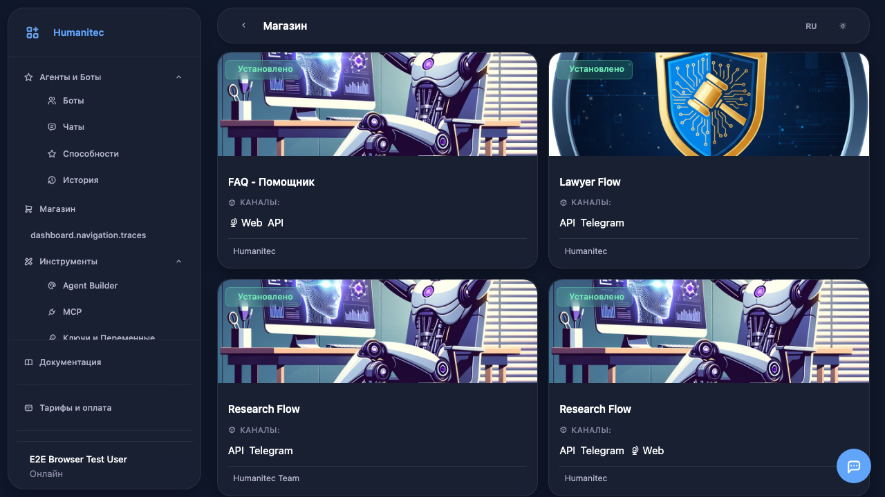
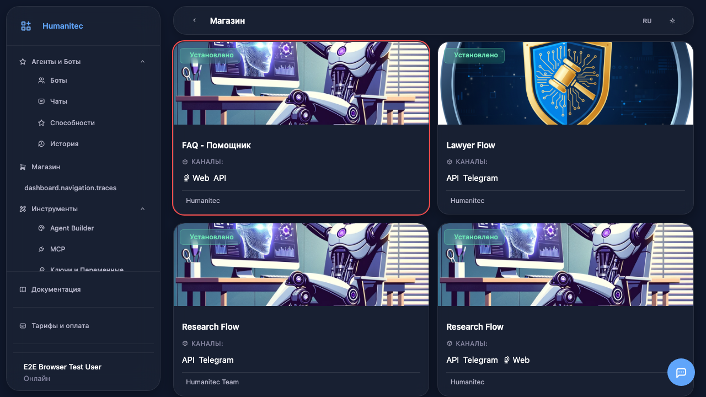
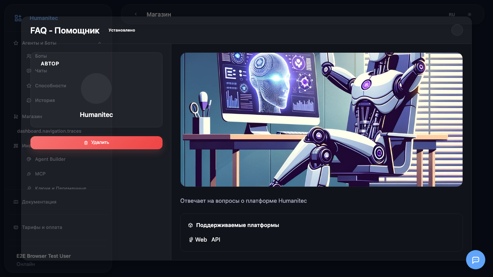

# Установка бота из магазина

## 1. Открытие магазина

Откройте раздел **Магазин** в боковом меню. Здесь представлены доступные для установки боты.

## 2. Выбор бота

Нажмите на карточку бота, чтобы открыть его описание.

## 3. Просмотр описания

Откроется окно с подробным описанием бота: его возможности, список способностей и необходимые настройки.

## 4. Бот установлен

Этот бот уже установлен. Вы можете найти его в разделе **Боты**.

