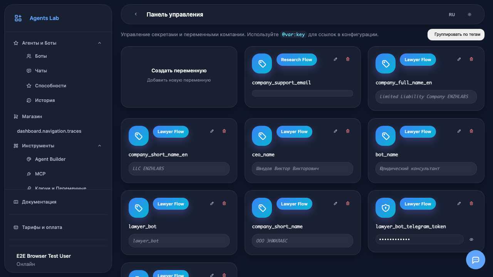
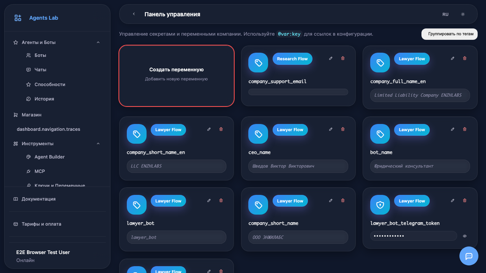
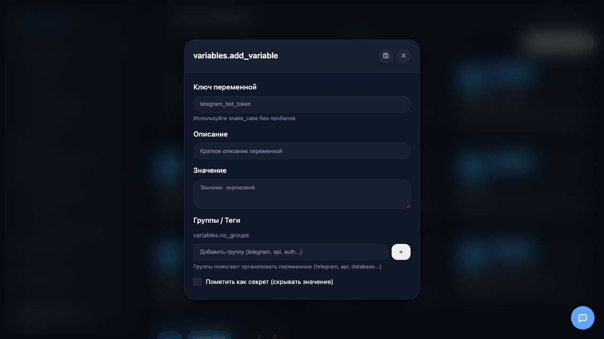
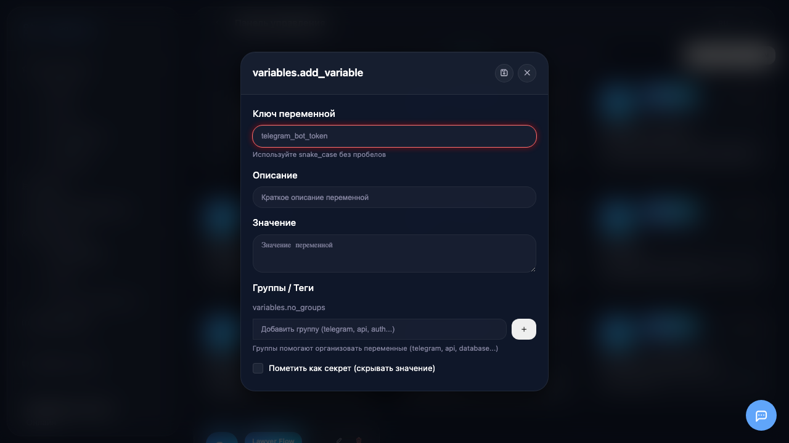
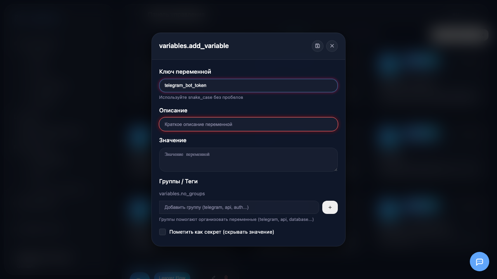
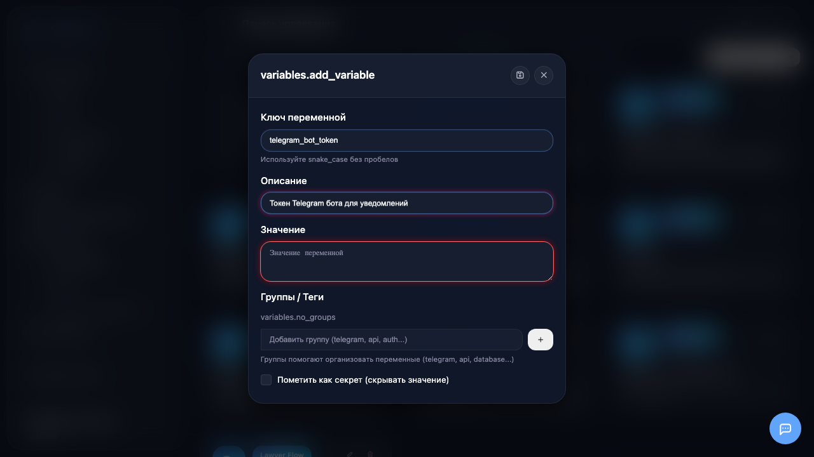
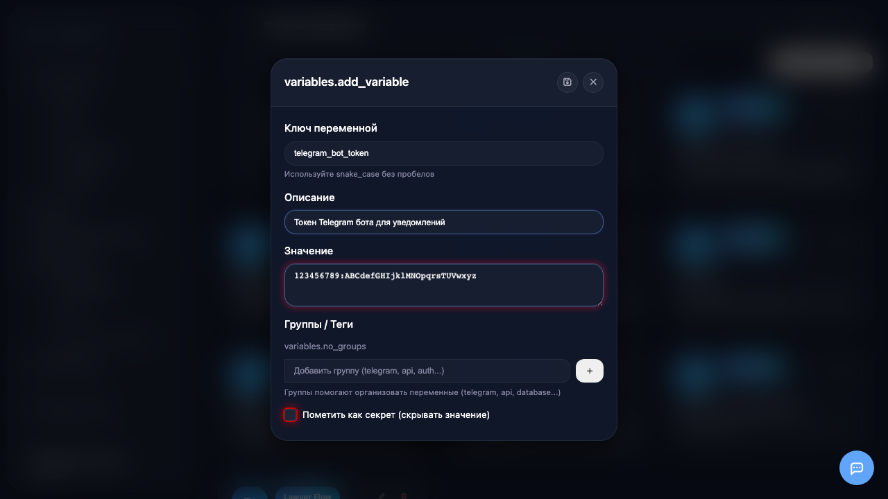
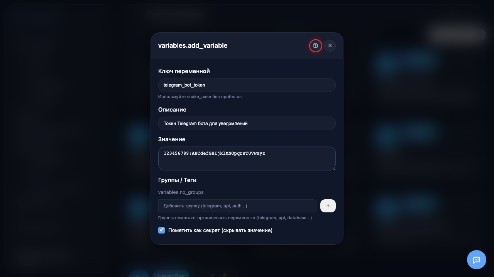
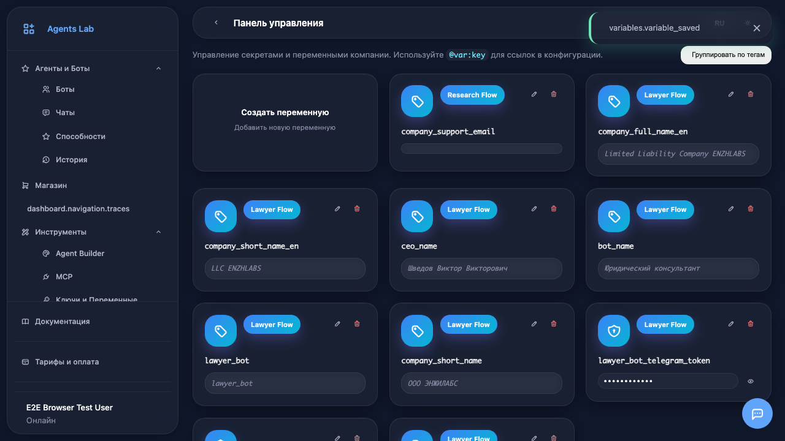

# Создание и настройка переменных

## Шаг 1

Откройте раздел **Переменные** в боковом меню. Здесь отображается список всех переменных компании.

## Шаг 2

Нажмите на карточку **Создать переменную** для добавления новой переменной.

## Шаг 3

Откроется модальное окно для ввода данных переменной.

## Шаг 4

Введите **ключ переменной** - это уникальный идентификатор. Используйте snake_case без пробелов (например, `telegram_bot_token`).

## Шаг 5

Добавьте **описание** переменной, чтобы потом было понятно её назначение.

## Шаг 6

Введите **значение** переменной. Для API ключей и токенов это обычно длинная строка.

## Шаг 7

Отметьте чекбокс **Секрет**, если значение должно быть скрыто (для паролей и токенов).

## Шаг 8

Нажмите кнопку **сохранения** (иконка дискеты) для создания переменной.

## Шаг 9

Переменная создана! Теперь её можно использовать в конфигурации ботов с помощью синтаксиса `@var:telegram_bot_token`.

