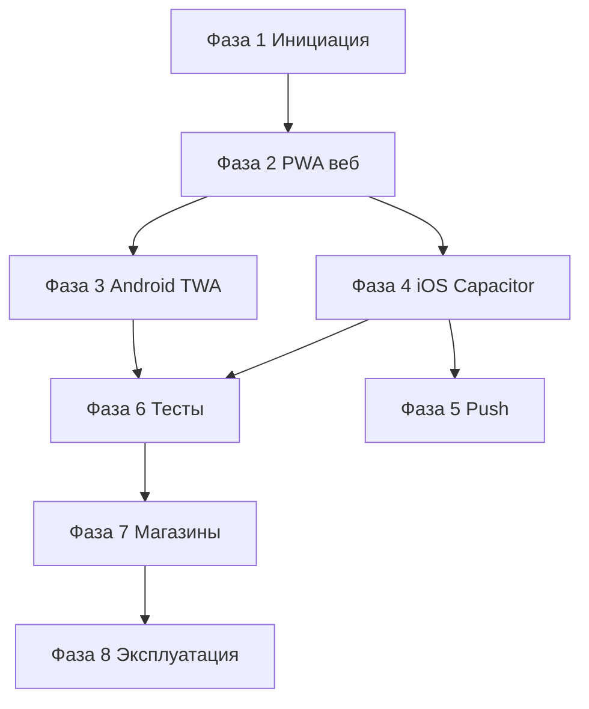

# Waterfall: PWA Humanitec в магазины приложений

Последовательная модель: следующая фаза начинается после закрытия ворот предыдущей. Параллельно допустимы только явно помеченные работы (например закупка dev-аккаунтов и юридическая проверка).

---

## Фаза 1 — Инициация и требования

**Цель:** зафиксировать границы продукта в магазинах и нефункциональные требования.

| Входы | Выходы (артефакты) |
|-------|-------------------|
| Стратегия домена (humanitec.ru, tenant-поддомены) | Документ: целевые магазины (минимум: Google Play, App Store; опционально: RuStore, AppGallery, Samsung Web Apps, Microsoft Store) |
| Список обязательных функций | Матрица: WebRTC, WS, push, файлы, запись аудио — для каждой платформы «должно работать / ограничение / обход» |
| Юрисдикция (РФ) | Решение по учётным записям разработчика и оплате подписок; список рисков (санкции, доступность облаков) |

**Ворота (критерии перехода):** утверждён перечень магазинов v1; владелец продукта подписал матрицу функций; для юридического лица — зафиксирован ответственный за Privacy Policy / Terms.

**Оценка:** 3–10 рабочих дней (зависит от согласований).

---

## Фаза 2 — Готовность веба (PWA и продакшен)

**Цель:** production URL соответствует требованиям PWA и магазинов до появления нативных оболочек.

| Входы | Работы | Выходы |
|-------|--------|--------|
| Фаза 1 закрыта | Lighthouse / аналог: installability, manifest, SW, HTTPS | Отчёт аудита (базовый порог — без блокирующих по выбранным магазинам) |
| `manifest.json`, `start_url`, `scope` | Проверка multi-tenant: поведение при `*.humanitec.ru` или выбранном пути входа | Решение: единый `start_url` для оболочки или сценарии ограничений |
| Бэкенд push (VAPID) | Проверка `GET .../api/push/vapid-public-key` на том же origin, что и приложение | Подтверждение работы подписки в браузере |

**Ворота:** отчёт без критичных замечаний; зафиксирован канонический URL для генерации TWA/Capacitor (`PWA_MANIFEST_URL` в [`config/env.example`](../config/env.example)).

**Оценка:** 1–2 недели с учётом исправлений фронта/бэка.

---

## Фаза 3 — Android: Trusted Web Activity

**Цель:** подписанный AAB/APK и тестовая выкладка.

| Входы | Работы | Выходы |
|-------|--------|--------|
| Фаза 2 | Установка Bubblewrap (см. [`mobile/package.json`](../package.json)), `bubblewrap init` / build | Исходники проекта TWA в каталоге, согласованном с [`android/README.md`](../android/README.md) |
| Ключ подписи release | Подпись AAB | Хранилище ключей вне git; процедура ротации задокументирована |
| Домен | Публикация **`/.well-known/assetlinks.json`** (шаблон: [`config/assetlinks.json.template`](../config/assetlinks.json.template)) | Файл на проде; проверка Digital Asset Links |

**Ворота:** приложение на устройстве без лишней адресной строки (при корректных asset links); внутренняя/закрытая тестовая группа в Play.

**Оценка:** 2–3 недели.

**Зависимость:** может частично пересекаться с юридической подготовкой учётной записи Google Play (Фаза 1).

---

## Фаза 4 — iOS: оболочка WKWebView (Capacitor)

**Цель:** Xcode-проект, загружающий production URL; подготовка к Guideline 4.2.

| Входы | Работы | Выходы |
|-------|--------|--------|
| Фаза 2 | `npm install`, `cap add ios`, конфиг из [`ios/capacitor.config.json.example`](../ios/capacitor.config.json.example) | Проект `ios/App` (локально; см. gitignore) |
| Список функций | `Info.plist`: камера, микрофон, при необходимости фото | Строки использования на русском/английском |
| Требования Apple | Продуктовое усиление: splash, офлайн, нативный экран «О приложении» или аналог | Скриншоты и бинарник для ревью |

**Ворота:** ручной прогон Sync (звонок, чат, голосовое, файл) на физическом iPhone; нет блокирующих крашей WebView.

**Оценка:** 3–5 недель.

---

## Фаза 5 — Уведомления вне приложения (опционально, но часто нужно для паритета)

**Цель:** фоновые push там, где Web Push в оболочке недостаточен (типично iOS из App Store).

| Входы | Работы | Выходы |
|-------|--------|--------|
| Фазы 3–4 по решению | APNs: ключи, Capacitor Push (или аналог) | Подписка на бэкенде с типом клиента `ios_native` |
| Существующий VAPID-поток | Единый API регистрации устройств на платформе | Дизайн и доработка backend + web |

**Ворота:** тестовая пуш-доставка на iOS в закрытой сборке.

**Оценка:** 2–4 недели (после базовых оболочек).

**Примечание:** Android TWA может оставаться на Web Push без этой фазы.

---

## Фаза 6 — Интеграционное тестирование и матрица устройств

**Цель:** подтверждение качества на реальном железе и ОС.

| Входы | Работы | Выходы |
|-------|--------|--------|
| Сборки Фаз 3–4 | Матрица: минимум 2–3 Android, 2 iOS, разные версии ОС | Протокол тестов с результатами |
| Критичные сценарии | Регрессия: авторизация, tenant, Sync, CRM, flows по приоритету | Список дефектов с приоритетами |

**Ворота:** нет открытых блокеров для публикации; либо зафиксированы известные ограничения в release notes.

**Оценка:** 2 недели.

---

## Фаза 7 — Магазины: метаданные, соответствие политикам, отправка

**Цель:** публикация в выбранных витринах.

| Входы | Работы | Выходы |
|-------|--------|--------|
| Фаза 6 | Скриншоты, описания, возрастной рейтинг, политика конфиденциальности URL | Заполненные карточки приложений |
| Юридические | GDPR/152-ФЗ по факту сбора данных | Ссылки в карточках |
| Сборки | Загрузка AAB/IPA, ответы на вопросы ревью | Статус ревью по каждому магазину |

**Ворота:** приложения доступны целевой аудитории (или в staged rollout).

**Оценка:** 1–2 недели на подготовку + 1–2 недели ожидание ревью (Apple часто дольше).

---

## Фаза 8 — Эксплуатация и обновления

**Цель:** устойчивый процесс после релиза.

| Работы | Выходы |
|--------|--------|
| Мониторинг крашей (Sentry и т.д.) в вебе и при необходимости в оболочках | Дашборд или алерты |
| Регламент: обновление только веба vs обязательный билд магазина | Документ |
| Версионирование `versionCode` / CFBundleShortVersionString | Соответствие релизам платформы |

**Ворота:** назначены ответственные за релизы магазинов; CI (когда будет внедрён) не падает на подписи.

---

## Сводка зависимостей между фазами

Фаза 5 может стартовать после Фазы 4; Фаза 3 и 4 параллельны после Фазы 2 при достаточных ресурсах.
